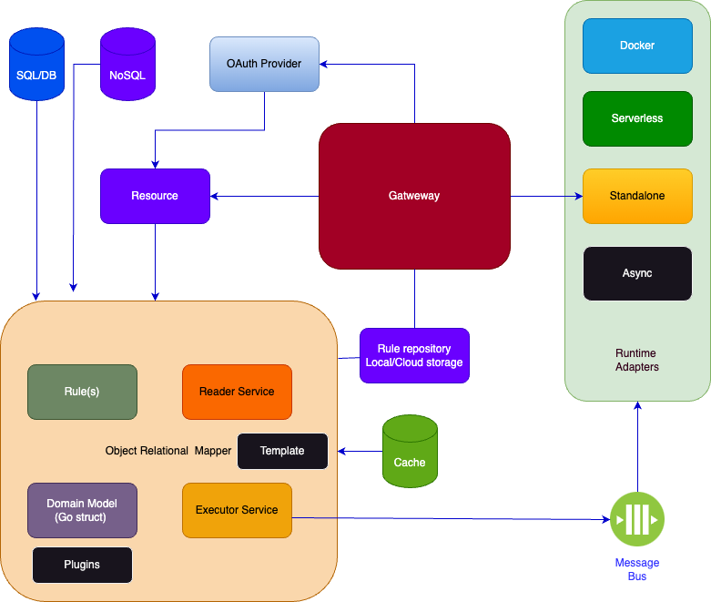
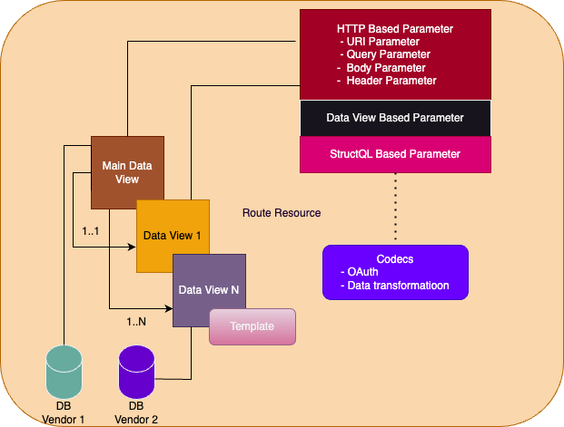
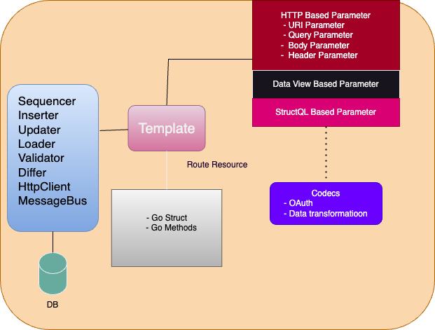

# Datly 

Datly has been design as modern flexible ORM for rapid development. 
Datly can operate in  **managed** , **autonomous** and **custom mode**.
In managed mode datly is used as regular GoLang ORM where you operate on golang struct and datly reader or executor service programmatically.

In autonomous mode datly uses a **dql** based rules with single gateway entry point handling all incoming request matching defined rules.

In custom mode datly also operates as single gateway entry point handling all incoming request, allowing
method/receiver go struct behaviour customization associated with the rule, this is achieved by custom data type registry 
with customize

Both _autonomous_ and _custom_ mode datly can be deployed as standalone app or as Docker, Kubernetes,or as Cloud Serverless runtimes (lambda,GCF,Cloud Run).

### Introduction

#### Datly architecture




#### Reader Service



Reader service allows reading and transforming data from various database vendors at once, datly
is responsible for assembling final data view. 
Datly can dynamically generate SQL Query with [velty](https://github.com/viant/velty) 
template language based on input parameters.
In addition, view data can be dynamically adjusted with pagination, field/column project 
or criteria selection or event case formatting all controlled by a client. 
On top of that any individual view data can be cached or pre-cache on the SQL based level, 
improving substantially  service response time and reduce data access cost.


#### Executor service



Executor service is used to validate, transform and modify data in database programmatically.
Post (insert), Put(update), Patch(insert/update) operation are supported.

Executor service use [velty](https://github.com/viant/velty) temple engine to operates on GoLang struct.
You can use ```datly gen``` command to generate initial dql with corresponding go struct(s) 
for single or multi relation data mutation.  Datly uses transaction to modify data in database.

For patch/update operation datly support input state distinction, with Has marker,
allowing handling user input effectively, ensuring data integrity, and improving the security of applications.
This approach simplify input validation and tracking actual changes supplied by a client.


## Reader

##### Reader dql structure

```sql
[RouteConfig]
    
import( 
    ... // go struct import
)   

#set( $_ = ...) //Parameter declaration    
    
SELECT mainViewAlias.*  [EXCEPT COLUMN][OutputConfig]
[, secondViewAlias.*       [OutputConfig]  ]
[, NviewAlias.*            [OutputConfig]  ]
FROM (
    SELECT
    ID  [ColumnConfig],
    ...,
     other_column   
    FROM table1
    ) mainViewAlias [ViewConfig],

[
 JOIN (
    SELECT OTHER_ID,
        ...,
        other_column
    FROM table2
    ) secondViewAlias  [ViewConfig] ON mainViewAlias.ID = secondViewAlias.OTHER_ID
    
]    
```

#### Reader hints
- **RouteConfig** is JSON representation of [Route](option/route.go) settings i.e {"URI":"app1/view1/{Id}"}
- **OutputConfig** is JSON representation of [Output](option/output.go) settings i.e {"Style":"Comprehensive"}
- **ColumnConfig** is JSON representation of [Column](option/column.go) settings i.e {"DataType":"bool"}
- **ViewConfig**  is JSON representation of [View](option/view.go) settings i.e {"Cache":{"Ref":"aerospike"}}


Datly uses specific dialect of SQL to define rule for view(s) and relation between them.

DSQL is transformed into datly internal view representation with the following command:

```go
datly translate -c='myDB|driver|dsn|secretURL|secretKey' -s=myRule.sql -d=autogen
```

where -d would persist rule with datly config to specific myProjectLocation

Once datly rules are stored, you can start datly with

```bash
datly run -c=myProjectLocation/Datly/config.json
```

#### Managed mode

In manage mode you use directly reader.Service, with provided view and underlying go struct.

```go
package mypkg

type Invoice struct {
	Id           int32      `sqlx:"name=id"`
	CustomerName *string    `sqlx:"name=customer_name"`
	InvoiceDate  *time.Time `sqlx:"name=invoice_date"`
	DueDate      *time.Time `sqlx:"name=due_date"`
	TotalAmount  *string    `sqlx:"name=total_amount"`
	Items        []*Item
}

type Item struct {
	Id          int32   `sqlx:"name=id"`
	InvoiceId   *int64  `sqlx:"name=invoice_id"`
	ProductName *string `sqlx:"name=product_name"`
	Quantity    *int64  `sqlx:"name=quantity"`
	Price       *string `sqlx:"name=price"`
	Total       *string `sqlx:"name=total"`
}

func ExampleService_ReadDataView() {

	aReader := reader.New()
	conn := aReader.Resource.AddConnector("dbName", "database/sql  driverName", "database/sql dsn")

	invoiceView := view.NewView("invoice", "INVOICE",
		view.WithConnector(conn),
		view.WithCriteria("id"),
		view.WithViewType(reflect.TypeOf(&Invoice{})),
		view.WithOneToMany("Items", "id",
			view.NwReferenceView("", "invoice_id",
				view.NewView("items", "invoice_list_item", view.WithConnector(conn)))),
	)

	aReader.Resource.AddViews(invoiceView)
	if err := aReader.Resource.Init(context.Background()); err != nil {
		log.Fatal(err)
	}

	var  invoices= make([]*Invoice, 0)
	if err := aReader.ReadInto(context.Background(), "invoice", &invoices, reader.WithCriteria( "status = ?",1));err != nil {
		log.Fatal(err)
	}
	invociesJSON, _:=json.Marshal(invoices)
	fmt.Printf("invocies: %s\n", invociesJSON)

	
}


```

See [Reader Service](../service/reader/README.md) for more details


#### Autonomous mode


See e2e [testcase](../e2e/local/regression/cases) for more examples


##### Usage

###### One to many

**rule.sql**
```sql
SELECT 
    dept.*
    employee.*
FROM DEPARMENT dept
JOIN EMP employee ON dept.ID = employee.DEPT_ID 
```

```bash
datly -N=dept -X=rule.sql -C='mydb|mydb_driver|mydb_driver_dsn' 
```


###### One to one relation

**rule.sql**
```sql
SELECT 
    dept.*
    employee.*,
    organization.*
FROM DEPARMENT dept
JOIN EMP employee ON dept.ID = employee.DEPT_ID
JOIN ORG organization ON organization.ID = demp.ORG_ID AND 1=1
```

```bash
datly -N=dept -X=rule.sql  -C='mydb|mydb_driver|mydb_driver_dsn' 
```

###### Excluding output column

**rule.sql**
```sql
SELECT 
    dept.* EXCEPT ORG_ID
    employee.* EXCEPT DEPT_ID, 
    organization.* 
FROM DEPARMENT dept
JOIN EMP employee ON dept.ID = employee.DEPT_ID
JOIN ORG organization ON organization.ID = demp.ORG_ID AND 1=1
```

```bash
datly -N=dept -X=rule.sql  -C='mydb|mydb_driver|mydb_driver_dsn' 
```


###### View SQL


**rule.sql**
```sql
SELECT 
    dept.* EXCEPT ORG_ID
    employee.* EXCEPT DEPT_ID, 
    organization.* 
FROM (SELECT * FROM DEPARMENT t) dept
JOIN (SELECT ID, NAME, DEPT_ID FROM EMP t) employee ON dept.ID = employee.DEPT_ID
JOIN ORG organization ON organization.ID = demp.ORG_ID AND 1=1
```

```bash
datly -N=dept -X=rule.sql  -C='mydb|mydb_driver|mydb_driver_dsn' 
```


###### View SQL with velty template and query parameters

```sql
SELECT 
    dept.* EXCEPT ORG_ID
    employee.* EXCEPT DEPT_ID, 
    organization.* 
FROM (SELECT * FROM DEPARMENT t) dept
JOIN (SELECT ID, NAME, DEPT_ID FROM EMP t) employee ON dept.ID = employee.DEPT_ID
JOIN ORG organization ON organization.ID = demp.ORG_ID AND 1=1
WHERE 1=1
#if ($Has.Id)
AND ID = $Id
#end
```

###### View SQL with query parameters

```sql
SELECT 
    dept.* EXCEPT ORG_ID
    employee.* EXCEPT DEPT_ID, 
    organization.* 
FROM (SELECT * FROM DEPARMENT t) dept
JOIN (SELECT ID, NAME, DEPT_ID FROM EMP t) employee ON dept.ID = employee.DEPT_ID
JOIN ORG organization ON organization.ID = demp.ORG_ID AND 1=1
WHERE ID = $Id
```

###### View SQL column type codec

```sql
SELECT 
    dept.* EXCEPT ORG_ID
    employee.* EXCEPT DEPT_ID, 
    organization.* 
FROM (SELECT * FROM DEPARMENT t) dept
JOIN (SELECT ID, NAME, DEPT_ID, 
    (CASE WHEN COLUMN_X = 1 THEN
            'x1,x2'
             WHEN COLUMN_X = 2 THEN
            'x3,x4'
       END) AS SLICE /* {"Codec":{"Ref":"AsStrings"}, "DataType": "string"} */  
    FROM EMP t) employee ON dept.ID = employee.DEPT_ID
JOIN ORG organization ON organization.ID = demp.ORG_ID AND 1=1
WHERE ID = $Id
```


###### Supported conversion Codecs
    - AsStrings: converts coma separated value into []string

###### Meta Views (aggregated views)

###### Data View Optimization

Datly default data assembly method use IN operation join with parent view data.

```sql
SELECT vendor.*,
products.* EXCEPT VENDOR_ID
FROM (SELECT * FROM VENDOR t ) vendor
JOIN (
    SELECT * FROM (
    SELECT ID, NAME, VENDOR_ID FROM PRODUCT t
    UNION ALL
    SELECT ID, NAME, VENDOR_ID FROM PRODUCT_ARCHIVE t
    ) t
)  products WHERE    products.VENDOR_ID = vendor.ID
```

in the following scenario  datly is unable to adjust product SQL with WHERE  products.VENDOR_ID IN(?,..,?) due to its complexity,
and would filter products data only after reading all UNION-ed data.
To address this potential data fetch performance issue you can use the following expression $View.ParentJoinOn("AND","VENDOR_ID")

```sql
SELECT vendor.*,
products.* EXCEPT VENDOR_ID
FROM (SELECT * FROM VENDOR t ) vendor
JOIN (
    SELECT * FROM (
    SELECT ID, NAME, VENDOR_ID FROM PRODUCT t  WHERE 1 = 1 $View.ParentJoinOn("AND","VENDOR_ID")
    UNION ALL
    SELECT ID, NAME, VENDOR_ID FROM PRODUCT_ARCHIVE t
    WHERE 1 = 1 $View.ParentJoinOn("AND","VENDOR_ID")
    ) t
)  products WHERE    products.VENDOR_ID = vendor.ID
```


###### Setting matching URI

```sql
/* {"URI":"dept/"} */
SELECT
dept.* EXCEPT ORG_ID
employee.* EXCEPT DEPT_ID
FROM (SELECT * FROM DEPARMENT t) dept               
JOIN (SELECT ID, NAME, DEPT_ID FROM EMP t) employee 
 ON dept.ID = employee.DEPT_ID
```


###### Setting data caching


```sql
/* {"URI":"dept/", 
   "Cache":{
         "Name": "aerospike",
         "Provider": "aerospike://127.0.0.1:3000/test",
         "Location": "${view.Name}",
         "TimeToLiveMs": 360000
         }
   } */
SELECT
dept.* EXCEPT ORG_ID
employee.* EXCEPT DEPT_ID
FROM (SELECT * FROM DEPARMENT t) dept                /* {"Cache":{"Ref":"aerospike"}} */
JOIN (SELECT ID, NAME, DEPT_ID FROM EMP t) employee  /* {"Cache":{"Ref":"aerospike"}} */
 ON dept.ID = employee.DEPT_ID
```

###### Setting selector

```sql
SELECT
dept.* EXCEPT ORG_ID
employee.* EXCEPT DEPT_ID
FROM (SELECT * FROM DEPARMENT t) dept                /* {"Selector":{"Limit": 40, "Constraints"{"Criteria": false}}} */
JOIN (SELECT ID, NAME, DEPT_ID FROM EMP t) employee  /* {"Selector":{"Limit": 80, "Constraints"{"Criteria": false, "Limit": false, "Offset": false}}} */
 ON dept.ID = employee.DEPT_ID
```


### Authentication


### Authorization


##  Executor

Executor service is used to validate, transform and modify data in database programmatically.
Post (insert), Put(update), Patch(insert/update) are supported.  


##### Executor DSQL

Executor DSQL uses the following structure
```dql
/* ROUTE OPTION */
import ...
#set( $_ = ...) //input paramter initialization

 DML | velocity expr (#set|#if|#foreach)

```
Where
- **View Parameter Hints** defines SQL based data view parameter

```sql
 #set($_ = $Records /* 
  SELECT * FROM MY_TABLE /* {"Selector":{}} */ WHERE ID = $Entity.ID
  */)
```

```sql
#set($_ = $PARAM_NAME<PARAM_TYPE>(PARAM_KIND/SOURCE) /* 
  optional SQL hint
*/)
```    


To generate initial executor DQL, use ```datly gen``` with reader dql defining
one or multi view with corresponding relations with additional input hints

All DML operation are executed in the one transaction, any errors trigger either 
by database or programmatically  ($logger.Fatalf) cause transaction rollback.


Executor dql rule can be generated from regular reader dql

- **simple object ({})** 
```sql 
     SELECT myTable.* /* { "Cardinality": "One" } */
    FROM (SELECT * FROM MY_TABLE) myTable
```

- **simple namespaced object i.e. {"Data": {}}**
```sql 
     SELECT myTable.* /* { "Cardinality": "One", "Field":"Data" } */
    FROM (SELECT * FROM MY_TABLE) myTable
```

- **array objects ([])** 
```sql 
  SELECT myTable.* /* { "Cardinality": "Many" } */
  FROM (SELECT * FROM MY_TABLE) myTable
```

- **array namespace objects {"Data": [{}]}**
```sql 
  SELECT myTable.* /* { "Cardinality": "Many" , "Field":"Data"} */
  FROM (SELECT * FROM MY_TABLE) myTable
```

- **nested relation**
```sql
SELECT
    dept.* /* { "Cardinality": "One", "Field":"Data" } */,
    employee.*,
    organization.*
FROM (SELECT * FROM DEPARMENT) dept
JOIN (SELECT * FROM EMP) employee ON dept.ID = employee.DEPT_ID
JOIN (SELECT * FROM ORG) organization ON organization.ID = demp.ORG_ID AND 1=1
```


```go
datly gen -h
datly gen -o=patch|post|put|delete  -s=myRule.sql -c='myDB|driver|dsn[|secretURL|secretKey]'  -p=$myProjectLocation
```

As a result the following file would be generated:
- dql/<myRule>.sql  - initial logic for patch|post|put|delete operations
- dql/<myrule>Post.json - example of JSON for testing a service
- pkg/<myrule>.go   - initial go struct(s)


Generated go struct(s) can be modified with additional tags.

Datly uses 'validate' and 'sqlx' tags to control input validation. 

Datly generate basic tempalte with the following parameters expressions

- #set($_ = $Entity<*Entity>(body/))  for simple object ({})
- #set($_ = $Entities<[]*Entity>(body/))  for simple array ([])
- #set($_ = $Entity<*Entity>(body/data))  for namespaced object ({"data":{}})
- #set($_ = $Entities<[]*Entity>(body/data))  for namespaced array ({"data":[]})


After adjusting logic in executor dql, 
```bash
datly translate -c='myDB|driver|dsn' -s=exeuctor_dql_rule.sql  -p=$myProjectLocation
```

For "complex" validation logic it's recommend to use datly in custom mode where all custom logic is implemented/unit tested 
in pure go  and datly intermediates in data retrieval and actual data modification.

#### Supported build in functions:

#### Logger/Formatter
- $logger.FatalF
- $logger.LogF
- $logger.PrintF
- $fmt.Sprintf

#### SQL
- $sequencer.Allocate(tableName string, dest interface{}, selector string) 
- $sqlx.Validate

#### Message bus
Universal message bus, provide ability to send/publish asyn message a message bus (i.e sqs/sns,pubsub,kafka) 
 - $messageBus.Message creates a message
 - $messageBus.Push push a message
 - 
```vm
 - #set($msg = $messageBus.Message("aws/topic/us-west-1/mytopic", $data))
  #set($confirmation = $messageBus.Push($msg))
  $logger.Printf("confirmation:%v", $confirmation.MessageID)
```

#### Validator
 - $sqlx.Validate - validates a struct with sqlx tags
 - $validator.Validate - validates struct with validate tag

#### HTTP
- $http.Do
- $http.Get
- $response.Failf
- $response.FailfWithStatusCode
- $response.StatusCode

#### Comparators
- $differ.Diff

TODO add all supported and update/add example


###### Validation

Any database constraint validation can be customized with [sqlx validator service](https://github.com/viant/sqlx#validator-service)
```dql
#set($validation = $sqlx.Validate($Entity))
#if($validation.Failed)
  $logger.Fatal($validation)
#end
```


###### Insert operation:

with service
```dql
$sequencer.Allocate("MY_TABLE", $Entity, "Id")
#if($Unsafe.Entity)
  $sql.Insert($Entity, "MY_TABLE");
#end
```

with DML
```dql
$sequencer.Allocate("MyTable", $Entity, "Id")
INSERT INTO MY_TABLE(ID, NAME) VALUES($Entity.Id, $Entity.Name)
```


###### Update operation:

```dql
$sequencer.Allocate("MyTable", $Entity, "Id")
#if($Unsafe.Entity)
  $sql.Update($Entity, "MyTable");
#end
```


with DML
```dql
UPDATE MY_TABLE SET 
    NAME = $Entity.Name
#if($Entity.Has.Description)
    , DESCRIPTION = $Entity.Description
#end
WHERE ID = $Entity.Id
```

###### Importing go types

```sql

/* {"Method":"PATCH","ResponseBody":{"From":"Product"}} */

import (
	"product.Product"
)
#set($_ = $Jwt<string>(Header/Authorization).WithCodec(JwtClaim).WithStatusCode(401))
#set($_ = $Campaign<*[]Product>(body/Entity))
```


###### Blending go call within dql

```sql

/* {"Method":"PATCH","ResponseBody":{"From":"Product"}} */

import (
	"./product.Product"
)
#set($_ = $Jwt<string>(Header/Authorization).WithCodec(JwtClaim).WithStatusCode(401))
#set($_ = $Campaign<*[]Product>(body/Entity))

#set($validation = $New("*Validation"))
#set($hasError = $Product.Init($validation))

....

#set($hasError = $Product.Validate($validation))

```

###### Fetching existing data with data view parameters

By default, all parameters are required,  adding '?' character before SELECT keyword would make parameter optional.
or !ErroCode for required with error code.

Note that all example below use '#set( $_ = ...)' syntax which defines datly parameters, 
where all these parameters are resolved
before template code runs.

Data view parameters use regular reader DSQL and can return one or more records.

```sql
#set($_ = $Records /*  !401 
  SELECT * FROM MY_TABLE  WHERE ID = $Entity.ID
*/)
```

```sql
#set($_ = $Records /*  ? 
   SELECT * FROM MY_TABLE  WHERE ID = $Entity.ID
*/)
```


In addition, records can be fetched to imported struct

```sql

import (
	"./product.Product"
)

...
    
#set($_ = $Records<[]*Product>(data_view/Product) /*  
  ? SELECT * FROM Producct  WHERE STATUS = $status
*/)
```


###### Fetching data with StructQL

- [StructQL](https://github.com/viant/structql)

Datly parameter can be also of 'param' kind to transform any other existing parameter with structQL.

```sql

import (
	"./product.Product"
)

#set($_ = $Products<*[]Product>(body/Data))

#set($_ = $ProductsIds<?>(param/Products) /* ?
   SELECT ARRAY_AGG(Id) AS Values FROM  `/`
*/)

#set($_ = $prevProducts<*[]Product>()/*
SELECT * FROM Products WHERE $criteria.In("ID", $ProductsIds.Values) 
*/)
```


In the example above in the first step collection of products is defined from POST body data field.
Second parameter extract all products ID with [structql](https://github.com/viant/structql), in the final prevProducts fetches all produces
where ID is listed in ProductsIds parameters.
Note that we use $criteria.In function to automatically generate IN statement if parameter len is greater than zero
otherwise the $criteria.In function returns false, to ensure correct SQL generation and expected behaviours


###### Indexing data

Any go collection can be index with IndexBy dql method 

```sql

#set($_ = $Records /*
  SELECT * FROM MY_TABLE
*/)


#set($ById = $Records.IndexBy("Id"))

#foreach($rec in $Unsafe.$Entities)
    #if($ById.HasKey($rec.Id) == false) 
        $logger.Fatal("not found record with %v id", $rec.Id) 
    #end
    #set($prev = $ById[$rec.Id])
#end

```


###### Authentication & Authorization

```sql
#set($_ = $Jwt<string>(Header/Authorization).WithCodec(JwtClaim).WithStatusCode(401))
#set($_ = $Authorization  /*
   !401 SELECT Authorized /* {"DataType":"bool"} */
    FROM (SELECT IS_VENDOR_AUTHORIZED($Jwt.UserID, $vendorID) AS Authorized) t
    WHERE Authorized
*/)
```


###### Record Differ

```sql
#set($_ = $Records /* {"Required":false}
  #set($Ids = $Entities.QueryFirst("SELECT ARRAY_AGG(Id) AS Vals FROM  `/`"))
  SELECT * FROM MY_TABLE /* {"Selector":{}} */
  WHERE  #if($Ids.Vals.Length() > 0 ) ID IN ( $Ids.Vals ) #else 1 = 0 #end */
)

#set($ById = $Records.IndexBy("Id"))

#foreach($rec in $Unsafe.$Entities)
    #if($ById.HasKey($rec) == false) 
        $logger.Fatal("not found record with %v id", $rec.Id) 
    #end
    #set($prev = $ById[$rec.Id])

    #set($recDiff = $differ.Diff($prev, $rec))
    #if($fooDif.Changed())
        INSERT INTO DIFF_JN(DIFF) VALUES ($recDiff.String());
    #end
#end
```

### Meta repository


#### OpenAPI

#### Internal View

#### Go Struct

#### Performance metrics

### Extending datly in custom mode

[Datly extension](extension/README.md)


### Caching architecture

#### Lazy Mode

#### Smart Mode


## Deployment

Datly is runtime agnostic and can be deployed as standalone app, or AWS Lambda, Google cloud function, Google Cloud run.
Entry point with deployment example are define under [Runtime](../gateway/runtime)

Datly deployment is entails datly binary deployment with initial rule set, follow by just rule synchronization.


On both autonomous and custom mode 'datly' uses set of rule, and plugins. 
On cloud deployment these assets are stored on cloud storage, thus to reduce cold start or rule changes detection and reload
it's recommend to set flag "UseCacheFS" in the datly config. This setting instructs daytly to use **datly.pkg.gz** cache file, for all underlying assets. 
Cache is created every time a cache file is deleted from a file storage.

#### Generating pre-packaged datly rule  

While building cache file with hundreds rules and assets cache file provides both cost and performance optimization on cloud storage, 
to prepackage  **datly rule** ahead of time run the following command:


```bash
    datly -P DATLY_ROOT_CONFIG -R CLOUD_STORAGE_DATLY_CONFIG_URL
  
    i.e  datly -P /opt/ws/Datly -R s3://myog-serverless-config/Datly
```

The above command creates datly.pkg.gz file containing all assets from DATLY_ROOT_CONFIG location, 
where each asset URL is rewritten with CLOUD_STORAGE_DATLY_CONFIG_URL


#### Project layout

The following layout organizes datly specific resources
```bash
  ProjectRoot
      | -  dql
            | - business Unit 1 (appName)
                 | - entity_X_get.sql
                 | - entity_X_put.sql 
                 | - entity_X_post.sql 
                 | - entity_X_patch.sql 
                ....
                 | - entity_N_get.sql
                 | - routerY.rt   
                 | - entity_N
                      - other_asset.xsd
                      
    
            | - business Unit N (appName)       
                 | - entityM_get.sql
                 ...
                 | - routerY.rt            
   - e2e (end to end testing workflows)
   - pkg         
      | -  mypackage1(business Unit 1)   
      |       | - entityX.go
      | -  mypackageN(business Unit Y)
              |  - ...      
   - deployment 
      - prod
         | - Datly
               | - dependencies
               | - plugins
               | - routes
               |  config.json
      - stage        
         | - Datly
               | - dependencies
               | - plugins
               | - routes
               |   config.json   
```


#### Autonomous Datly

To build standalone binary:
```bash
git clone https://github.com/viant/datly.git
cd datly/cmd/datly
go build
datly -h
```

To build datly for  Docker or cloud specific[Runtimes](../gateway/runtime) 
check **deploy.yaml** [endly](https://github.com/viant/endly) deployment workflows.


##### Component debugging

```go
package doc

import (
	"context"
	"encoding/json"
	"fmt"
	"github.com/viant/datly"
	"github.com/viant/datly/repository"
	"github.com/viant/datly/view"
	"github.com/viant/scy/auth/jwt"
	"io"
	"log"
	"net/http"
	"reflect"
	"strings"
)

type Product struct {
	Id       int
	Name     string
	VendorId int
}

func (p *Product) OnFetch(ctx context.Context) error {
	fmt.Println("breakpoint here")
	return nil
}

func (p *Product) Init() {
	fmt.Println("breakpoint here")
}

func (p *Product) Validate() bool {
	fmt.Println("breakpoint here")
	return true
}

type Validation struct {
	IsValid bool
}

// Example_ComponentDebugging show how to programmatically execute executor rule
func Example_ComponentDebugging() {
	//Uncomment various additional debugging and troubleshuting
	// expand.SetPanicOnError(false)
	// read.ShowSQL(true)
	// update.ShowSQL(true)
	// insert.ShowSQL(true)

	ctx := context.Background()
	service, _ := datly.New(context.Background())
	ruleURL := "yyyyyyy/Datly/routes/dev/product.yaml"

	components, err := service.LoadComponents(ctx, ruleURL, repository.WithPackageTypes(
		view.NewPackagedType("domain", "Product", reflect.TypeOf(Product{})),
		view.NewPackagedType("domain", "Validation", reflect.TypeOf(Validation{}))),
	)
	if err != nil {
		log.Fatal(err)
	}
	httpRequest, err := http.NewRequest(http.MethodPut,  "http://127.0.0.1:8080/v1/api/dev", io.NopCloser(strings.NewReader(`{"Name":"IPad"}`)))
	if err != nil {
		log.Fatal(err)
	}
	err = service.SignRequest(httpRequest, &jwt.Claims{
		Email:  "dev@viantinc.com",
		UserID: 111,
	})
	if err != nil {
		log.Fatal(err)
	}
	aComponent := components.Components[0]
	aSession := service.NewComponentSession(aComponent, httpRequest)
	response, err := service.Operate(ctx, aComponent, aSession)
	if err != nil {
		log.Fatal(err)
	}
	data, _ := json.Marshal(response)
	fmt.Printf("%T, %s\n", response, data)
}


```


#### Executing rule with go debuger

Datly is purely written and go, and thus it's possible to take any rule and load it and run it as if it was
defined in the managed mode, you can set breakpoint to any method call from template.
In addition, you can implement one of the following to be invoked on actual insert or update.

```go
type Insertable interface {
    OnInsert(ctx context.Context) error
}

type Updatable interface {
    OnUpdate(ctx context.Context) error
}
```

See [Component debugging](#component-debugging) section


##### Debugging reader rule

To debug reader, add go struct import statement at the top of the rule, you can get struct definition from

```bash
open http://127.0.0.1:8080/v1/api/meta/struct/dev/products
```

- **product.yaml**

```sql
/* {"URI":"dev/products"} */

import (
    "product.Product"
)

SELECT product.*
FROM (SELECT * FROM PRODUCT) product /* {"DataType":"*Product"} */
```


You can define of one to following for setting debugger breakpoint:

- **OnFetch(ctx context.Context) error**: invoked by reader once record is fetched from database
- **OnRelation(ctx context.Context)**: invoked by reader once all relations are assembled


See [Component debugging](#component-debugging) section