# Architecture: one contract, one invocation path

[All guides](README.md)

Datly assembles APIs from declared inputs, views, relations, handlers and outputs.
The public contract is typed even when its source starts as DQL. This keeps
transport binding, SQL construction and application behavior connected without
making them one mutable runtime object.

```mermaid
flowchart LR
    A[Go packages and DQL] --> B[Discovery and canonical metadata]
    B --> C[Typed contracts and handler semantic AST]
    C --> D[Go or Velty artifacts]
    C --> E[Bootstrap and registration]
    D --> E
    E --> F[Immutable application generation]
    F --> G[HTTP or MCP]
    G --> H[Scoped binding and handler invocation]
    H --> I[SQLX reads or scoped Data capabilities]
    I --> J[Completion and output finalization]
```

## Terms that affect application design

| Term | Meaning |
| --- | --- |
| Component | Typed input/output plus registered reader, Go or Velty behavior and route metadata. |
| View | A typed query projection with query controls and relations. |
| Relation | How a source dataset connects to a typed target and output holder; composite keys remain complete tuples. |
| DerivedView | An ordinary related view computed from a parent query, such as count or bounds. Declared with `output/derived`. |
| SelfReference | Recursive parent/child entities within a view; distinct from query-derived output. |
| Presence | What the caller actually supplied, separate from zero values, initialized fields and later allocated IDs. |
| Generation | A validated, published set of components, types, resources and protocol metadata. |
| Invocation | Request-local values, canonical input, service capabilities and completion state. |

## Source to typed Go or Velty

[Transcribe](../transcribe/compiler.go) discovers selected packages and DQL,
resolves package authority and canonical types, and compiles metadata. Handler
semantics live in `transcribe/handler/ast`; `compiler` builds that semantic
model, and sibling Go/Velty lowerers consume it. Artifact assembly, owned-field
regeneration and persistence belong to `transcribe/generate`.

Compilation's semantic AST is immutable. Generation enriches a clone rather
than modifying compiled handler meaning. Linked Go types retain package identity;
an unresolved qualified name must fail instead of becoming an empty local type.
This adapts original Datly's newer `repository/shape` pipeline, not its older
translator architecture. See [authoring](authoring.md).

## Execution and dependencies

At registration, canonical package/DQL metadata compiles into immutable Bindly
plans. The `InputContract` owns the value projection. Invocation adapters bind
request data, component dependencies and services into one scoped injector.
SQL execution receives an invocation-scoped SQLX parameter resolver, not a
second input plan or request map.

HTTP preserves the original request at the protocol boundary. Internal component
calls use the registered component authority and invocation context. Public
package selection controls protocol exposure; a private dependency may still be
registered for internal use. Authorization remains part of its declared policy.

Reader, Go and Velty behavior enters the same handler engine. A handler requests
focused services or the public `handler.Data` aggregate. Data owns sequencing,
buffered operations and transaction completion. A caller-supplied transaction
remains caller-owned; flushing work into it does not confirm commit.

## Ownership map

| Concern | Owner |
| --- | --- |
| Public application contracts and capabilities | Matching `xdatly` SDK |
| Binding plans, value projection and resource store | Bindly, adapted at registration/invocation |
| Type expressions, fields, runtime types and descriptor cloning | `viant/x` and `x/shape` |
| Datly source/package authority and precedence | [typecatalog](../typecatalog) |
| Typed row mapping and native read cache services | SQLX `io/read` |
| Reader collection, relation policy and SQL build inputs | [sql/reader](../sql/reader), [sql/builder](../sql/builder) |
| Mutation policy and custom orchestration | Handler semantic compilation and application handlers |
| Artifact assembly and protected regeneration | [transcribe/generate](../transcribe/generate) |
| Generation publication and owned background lifetime | [application](../application) |
| HTTP/MCP protocol adaptation | [gateway](../gateway), [mcp](../mcp) |

Normal row execution does not use `[]map[string]any` as an intermediate result
or cache contract. Derived outputs remain ordinary typed relations; runtime
metadata does not add a parallel view shape. Read caching stays native to SQLX,
including warmup; handlers do not acquire a second cache lifecycle.

## Reload and lifetime

`application.Manager.Reload` publishes a complete validated generation. A failed
build keeps the prior generation active. Already admitted work retains its pinned
metadata and services. Explicit reload is an embedding API; it is not a file
watcher or a way to replace compiled Go methods.

Shutdown closes admission, cancels and joins managed warmup/async work, then
drains optional telemetry. HTTP servers must drain accepted protocol requests.
A timeout returned to a shutdown caller does not make resources safe to close
under still-running handlers. [Configuration](configuration.md) and
[async](async.md) describe those operational boundaries.
