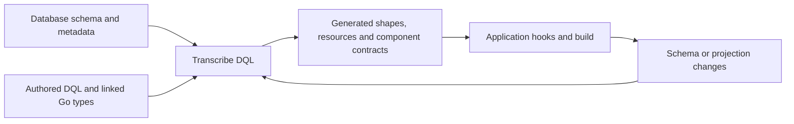

# Author source, generate typed artifacts


See [DQL syntax and grammar](dql.md) and [reader/writer hook flow diagrams](hooks.md).
[All guides](README.md) · [Architecture](architecture.md)

Choose Go shapes when your domain types already exist. Choose DQL when SQL is
the natural starting point, importing existing Go types where appropriate.
Generated shapes are useful when the projection itself defines the contract.
All three choices must preserve type/package authority and authored behavior.

## The schema-to-code synchronization cycle



Transcription/refinement reads the configured metadata authority. Regeneration
updates generator-owned shapes as the authored projection changes, including
pointer/value changes and dropped columns. Explicit DQL types and names retain
their authority; ambiguous output columns are errors. Protected application edits
and hook files must survive repeated generation.

This is the generation/update cycle, not an implicit database watcher. Re-run
transcription after a schema or DQL change, inspect its diagnostics and generated
diff, then build or publish the new generation. In-flight invocations retain their
admitted generation. Writer Current/Previous reads are a separate state-comparison
mechanism for sparse mutation policy; see [mutations](mutations.md).

## A small DQL reader

This is an authoring example for a package containing `Records.dql`; configure
the `main` connector and provide `records(id, tenant_id, name)` before executing:

```sql
#setting($_ = $route('/v1/records', 'GET'))
#setting($_ = $connector('main'))
#define($_ = $TenantID<int>(query/tenantId).Required())
SELECT r.id, r.tenant_id, r.name, set_limit(r, 100)
FROM records r
WHERE r.tenant_id = :TenantID
```

`#setting` declares component metadata. `#define` declares typed binding.
`set_limit` is a view control removed from executable SQL and mapped into query
configuration. `:TenantID` becomes a bound argument. This example filters by a
caller parameter; it does **not** prove that the caller may access that tenant.
Add a [verified authorization predicate](security.md).

After the README setup, the supported CLI validates module-qualified packages:

```sh
go run ./cmd/datly validate -dir "$DATLY_DEMO_DIR" example.com/buildapp/records
```

For your application, substitute its local source directory and actual package
path. Repeat `-module-dir` for additional local modules and `-exclude` for
packages that should not contribute components. Private type dependencies can
remain available without exposing their routes. `validate` reports skipped
checks; it does not build and deploy an application.

## Compilation and persistence are separate

The programmatic source pipeline uses `transcribe.Discovery.Compile` for package
selection and `transcribe.Compiler.Compile` for canonical source compilation.
`transcribe.ProjectGeneration` and `transcribe/generate` own artifact generation
and persistence. The candidate CLI has `init`, `build`, `validate`, `run` and `start`; do not assume
`generate`, `deploy`, `watch` or plugin-loading commands exist.

Use the existing [generation integration examples](../transcribe/generate_test.go)
and [project owner](../transcribe/project.go) when embedding the compiler.
Provide package/type/resource authority and resolve declared SQL resources
before compiling. Inspect diagnostics and generated contracts before persistence,
then use [project build](project-build.md) to discover and link the resulting Go packages internally.
Generated Go packages must be built and linked before their component can run.

## Generate from the CLI

Use the operation-based CLI workflow described in [the writer guide](mutations.md#cli-generation-and-generated-code).
Author an explicit `#package` in each reader/writer DQL, select the source package
and project root, and choose the operation. Standard writers are generated Go;
application code belongs in the generated customization points.

Use `datly transcribe patch`, `datly transcribe get`, `datly transcribe post`, or
`datly transcribe put`, followed by options and the source package. Go is the
default output. The command derives the required request and previous-state
contracts from the authored graph.

## Imported types, field tags and SQL macros

Use full module/package identities and declared import aliases. Rich projections
can refer to an imported type with `CAST(view.field AS alias.Type)` and refine
metadata through `tag(view.column, '...')`. Whether a field is a physical JSON
column, an internal backing column or a logical hook-built value matters:

- A physical field retains its SQL mapping and codec behavior.
- `internal:"true"` hides application-facing data without meaning `sqlx:"-"`.
- A logical non-DML value needs its explicit mapping policy and backing fields.
- NULL is distinct from zero; use an appropriate nullable shape and verify the
  reader's NULL policy.

See the [maintained grammar](../llm/datly-reader/references/dql-grammar.md)
and [rich-shape examples](../llm/datly-reader/references/reader-examples.md#rich-public-shape).
Those references include required patterns with incomplete acceptance. Do not
infer every imported CAST/codec/hook combination works from a tag parse alone.

View controls such as `use_connector`, `use_cache`, `cache_warmup`, `order_by`
and `set_limit` feed typed query settings. Builder helpers such as
`$View.ParentJoinOn(...)` and `$View.Name.NonWindowSQL` feed SQL expansion. They
are different mechanisms; neither is permission to interpolate client SQL.

## Regenerate without losing authored code

Generation tracks ownership and fingerprints. Existing fields retain order;
new generated fields append. Proven generated fields can change type or be
removed when the owned projection changes. Unrelated authored fields, methods,
tags and comments remain protected. An older file without sufficient ownership
evidence is not automatically safe to overwrite or delete.

Put business logic in authored handlers/hooks and keep generated orchestration
owned by generation. If persistence rejects an edit conflict, inspect the
conflicting ownership; do not erase hand edits just to force regeneration.
[Regeneration rules](../transcribe/generate/REGENERATION.md) explain the evidence.

## Resource and reload rules

Use standard `fs.FS`, including `embed.FS`, through the canonical resource store.
Preserve full `${embed:<resource-ref>}` references. Named stores require explicit
`namespace:path`; registration order must not choose an implicit default. Missing
SQL/template resources fail before runtime execution.

Publish a coherent new generation only after source, contracts and resources
validate. Reload can change supported metadata/DQL against linked contracts;
Go method or shape changes require rebuilding. [Configuration](configuration.md)
explains this boundary for standalone applications.

For a generated component loaded from its Go package, the ownership manifest
retains its destination and linked SQL resources. Static validation and reload
preserve those resources and do not adopt edited SQL as a fresh generator
baseline. Later transcription still protects authored changes.

## CAST, pointers, column drop and to-one regeneration

Use the imported type's full package identity, with only explicitly declared
import aliases. A standalone `CAST(r.amount AS *float64)` refines the Go shape;
removing the pointer changes nullability again. SQL `CAST(expr AS SQLType) AS name`
remains executable SQL. Physical JSON/custom typed fields retain SQL mapping and
codecs; logical pseudo fields need their explicit non-DML policy.

Regeneration must propagate reader and writer pointer/value changes and remove
only proven generated columns that disappeared from the owned projection. Keep
field order stable, append additions, protect authored methods/tags/comments and
reject edited generated-field conflicts. Never infer a new output alias to
resolve duplicate column names; follow the integrated
[naming rules](selectors-and-formats.md).

A relation join such as `LEFT JOIN detail d ON p.id = d.parent_id AND 1=1`
adds the supported to-one cardinality hint while retaining the actual join key.
It is not an authorization condition and does not enforce database uniqueness.
The reader/writer shape uses a pointer holder for One and a slice for Many.
Adding the hint must regenerate a generated Many holder to One; removing it must
regenerate One back to Many, including generated access/presence and writer
traversal. Explicit cardinality controls retain precedence over the hint. Authored holder edits remain
protected in either direction. Check both transitions through generation,
reload and real query/write behavior, not just a parsed cardinality flag.
