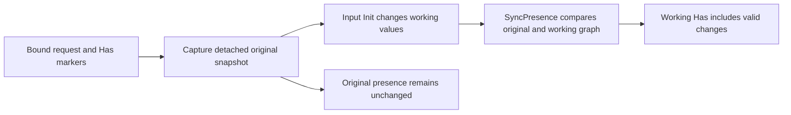

# Generated mutators, Has markers and SyncPresence

[All guides](README.md) · [Hook flow diagrams](hooks.md) · [DQL grammar](dql.md) · [Errors and custom output](errors-and-output.md)

A generated mutator is an explicit writer product selected during transcription.
It turns the authored write graph into typed capture, comparison, validation,
sequencing and DML code. It does not automatically generate a reader/writer pair
inside one component declaration. A separate reader component can expose the
same domain data through its own DQL, inputs and output contract.

## What the generator supplies

| Generated concern | Purpose | Application responsibility |
| --- | --- | --- |
| Input/output and entity shapes | Typed request, response and writable graph | Author source types/projections and desired names |
| Presence markers and setters | Distinguish omitted fields from supplied values | Use setters when hooks intentionally change business fields |
| Capture and synchronization support | Retain original intent and reconcile working markers | Do not replace original identity or captured topology |
| Previous-state readers and typed matching | Compare complete identity tuples with database state | Declare the Current/Previous source needed by the operation |
| Mutation program/adapter | Run the ordered phases using invocation capabilities | Select the writer target/policy explicitly |
| Hook scaffolds, when requested | Provide application customization files | Add business rules and scoped service dependencies |
| SQL/resources and component metadata | Register and execute the selected writer | Build/link and publish the generated component |

Generated file names depend on DQL names and destination options. Inspect the
returned generation plan/file list rather than guessing paths. Generated-owned
files can be updated under their ownership/fingerprint rules; create-once hook
files and authored edits must be preserved.

## Four different kinds of state

1. **Original request values and presence:** captured before `Init`/`InitMCP`.
2. **Working entity:** the typed value that hooks, backfill and sequencing process.
3. **Previous database row:** loaded from the authored current-state read, not
   manufactured from the request.
4. **Previous field evidence:** identifies which database fields were actually
   loaded; missing evidence is not permission to treat a field as known zero.

Keeping these separate is what makes sparse updates and business hooks compatible.

## Has markers: omission is not zero

Consider these request bodies for an existing order:

```json
{"id": 42}
```

```json
{"id": 42, "note": null, "enabled": false, "quantity": 0}
```

The first request does not ask to replace Note, Enabled or Quantity. The second
supplies all three, even though their values are null, false and zero. A `Has`
marker records suppliedness independently of the field's Go value.

A simplified marker-bearing shape looks like this:

```go
type OrderHas struct { ID, Note, Enabled, Quantity bool }
type Order struct {
    ID int
    Note *string
    Enabled bool
    Quantity int
    Has *OrderHas `setMarker:"true" sqlx:"-" json:"-"`
}
```

This illustrates the marker contract; actual names and field types come from
the authored/generated shape. Markers are internal metadata, excluded from SQL
and public JSON/MCP schemas. They are not a client-supplied patch mask to trust.

## Why SyncPresence exists

Binding establishes request presence. Input initialization or business preparation
can subsequently change the working Go values. `SyncPresence` compares those
working values with the captured pre-initialization snapshot and marks changed
non-identity fields while preserving explicit markers.

For example, an omitted Name initially has its Go zero value. Input initialization
sets a default Name. Synchronization can mark that working change for the writer,
while `state.Original.Has("Name")` still reports that the client omitted Name.
An explicitly supplied zero remains supplied even if the value did not change.



The public snapshot contract is `handler.EntitySnapshot[T]`. Its
`SyncPresence(current *T) error` synchronizes markers. Generated owned entities
may expose `entity.SyncPresence(snapshot)` as a typed delegate. The generated
program invokes synchronization in its lifecycle; application code should not
invent another snapshot or repeat synchronization at arbitrary phases.

Synchronization does not perform SQL, commit writes, refresh Previous from the
database, or reclassify an entity because a new ID was allocated. It verifies
captured associations and fails on ambiguous/changed topology. On a synchronization
error, marker changes are not partially applied. See the
[entity synchronization generator](../transcribe/handler/golang/entity_sync.go).

## Invariants and sparse updates

An invariant groups fields that must be considered together. Suppose `StartDate` and
`EndDate` define an interval, but a PATCH supplies only StartDate:

```go
StartDate *time.Time `invariant:"Window"`
EndDate   *time.Time `invariant:"Window"`
```

After presence synchronization, invariant backfill supplies missing group values
from the authoritative Previous row where the compiled policy permits it. Business
validation can then check the complete interval. Backfill must not claim that the
client supplied EndDate, and missing Previous field evidence cannot be treated as a
loaded zero. New inserts have no previous row to borrow.

For DQL-generated fields, field tags are authored through supported `tag(...)`
refinements. Read the [DQL grammar](dql.md#rich-cast-pseudo-fields-and-tag-customization)
and [mutation rules](mutations.md) for the projection/validation boundaries.

## Add business hooks after generation

Opt into hook scaffolding through the transcription `HookOptions`, then edit the
create-once application hook file. For an existing hook type, author
`entity_hooks(viewAlias, 'hooks.OrderHooks')` in the DQL projection and import its
Go package. A hook must match the generated entity/parent type exactly.

`EntityHooks[T,P]` supplies Init and Validate on one invocation-scoped object.
Init uses marker-aware setters when changing business values. Validate checks
business rules without mutating the working values, markers or Previous snapshot.
`AfterSequence` observes allocated IDs; `AfterQueue` observes buffered work.
Neither establishes that a transaction committed.

[The complete flow and hook table](hooks.md#generated-writer-flow) shows the order.
The compiled policy supplies traversal, Previous context and transaction services;
hook authors do not reimplement graph walking or expose raw transaction control.

## Inject a message bus and publish after completion

```go
type OrderHooks struct {
    Bus handler.MessageBus `bind:"kind=mbus,required"`
}
```

Import `github.com/viant/xdatly/handler`. The host must configure the bus capability;
the field tag requests it rather than constructing a broker connection.

The root hook can implement `mutation.Finalizer[Input, Output]`. In that Finalize
method, check `outcome.CommitConfirmed()` before calling
`h.Bus.Push(ctx, h.Bus.Message("orders.changed", payload))`. Build the payload's
IDs after sequencing/reconciliation. Capture event intent during the business
phases, then send only after confirmed commit.

An error after commit does not roll the database back. Caller-owned pending
transactions are not confirmed commits; their owner must arrange later completion.
See [errors and output](errors-and-output.md) for client-facing handling.

## Regenerate safely

Change DQL or database metadata, rerun transcription, inspect the generated diff,
and rebuild. Type/pointer changes and dropped projection fields update only
proven generator-owned shapes. Preserve application hook files and do not delete
ownership metadata to bypass a conflict. A reader regeneration and a writer
regeneration are separate operations with separate selected products.
