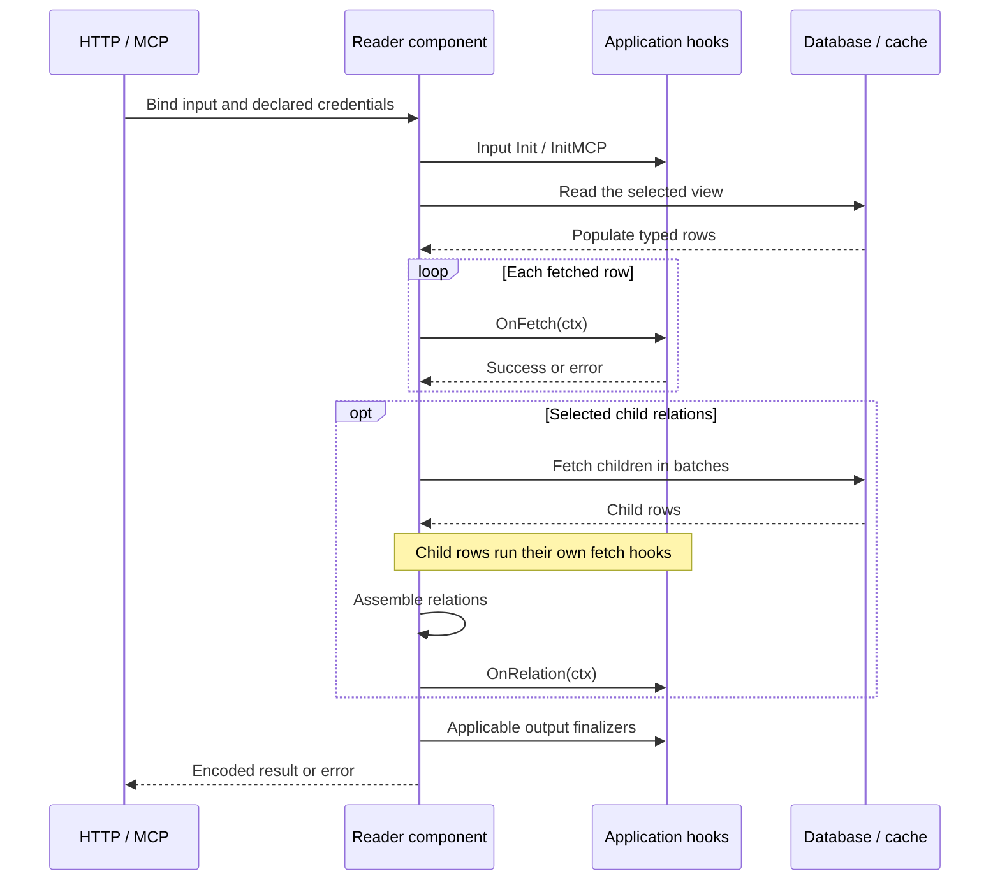
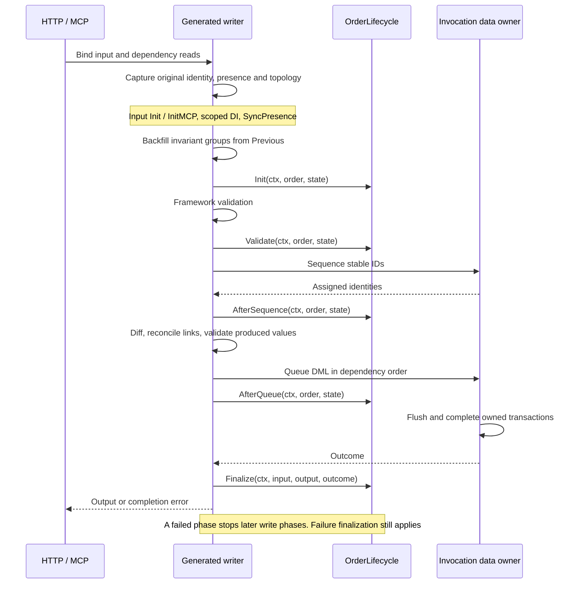

# Reader and writer hooks: execution flows

[All guides](README.md) · [DQL grammar](dql.md) · [Readers](readers.md) · [Mutations](mutations.md)

Hooks connect application behavior to typed data execution. Datly supplies the
invocation context and scoped dependencies; application hooks supply business
preparation, validation and completion behavior. Reader row hooks and generated
mutation hooks have different phases and contracts.

## Reader flow



`OnFetch(context.Context) error` runs after SQLX fills the typed row, before
Datly indexes or relates it. Use it for row-local preparation; returning an error
fails the fetch. `OnRelation(context.Context)` runs after selected children are
assembled and has no error return. An omitted relation is not proof of an empty
relationship in the database.

Partitions and batched relation reads must complete before their view reduction.
Reducer input order across partitions is unspecified. Input initialization and
output finalization run at invocation scope, separately from per-row hooks.

See the implemented [reader hook dispatch](../sql/reader/hooks.go),
[reader service](../sql/reader/service.go) and
[batched hook tests](../sql/reader/batch_runtime_sqlite_test.go).

## Generated writer flow

This is the optional generated mutation policy. Custom Go handlers can
compose the same capabilities with explicitly authored orchestration; the HTTP
verb alone does not install this policy.



Any failing phase stops later write phases. The invocation owner resolves failure
and transaction completion before outcome-aware finalization. A failed early
capture can reach `Definition.FinalizeFailure` without a prepared Program.
A caller-owned transaction remains pending from this invocation's perspective.

The order is implemented by the [mutation adapter](../runtime/handler/mutation/adapter.go)
and [generated policy phases](../transcribe/handler/golang/mutation_program.go).

## Writing-hook contracts

| Hook | What it receives and may do |
| --- | --- |
| `EntityHooks[T,P].Init(ctx, entity, state)` | Prepare business values after presence synchronization/backfill; use marker-aware setters. |
| `EntityHooks[T,P].Validate(ctx, entity, state)` | Check business rules after framework validation. Do not mutate values, markers or Previous. |
| `AfterSequenceHook[T,P].AfterSequence(ctx, entity, state)` | Observe allocated identities before diffing; preserve validated business values. |
| `AfterQueueHook[T,P].AfterQueue(ctx, entity, state)` | Observe successfully queued work. It is not commit confirmation. |
| `mutation.Finalizer[I,O].Finalize(ctx, input, output, outcome)` | Handle the completed outcome, including failure and caller-pending work. Gate commit-dependent messages on `outcome.CommitConfirmed()`. |

`EntityState[T,P]` supplies typed `Previous`, `PreviousFields`, `Parent`,
`SelfParent` and immutable original presence. A root uses `handler.NoParent`.
The same invocation-scoped hook object serves its Init/Validate/observation
callbacks and can receive input, logger, message bus or other configured scoped
services through dependency injection. The runtime owns traversal and transactions.

Declare an authored hook on a DQL view with:

```sql
#import('hooks', 'example.com/app/hooks')
SELECT orders.*, lifecycle_type(orders, 'hooks.OrderLifecycle')
FROM (SELECT o.* FROM ORDERS o) orders
```

The hook methods must match the actual entity and parent types. See
[the typed hooks fixture](../transcribe/testdata/mutationhooks/model.go) for real
Init/Validate methods with scoped input/logger injection and original-presence checks.

## Sparse updates and invariants

| Input state | Meaning |
| --- | --- |
| Field omitted | No client request to replace that field; retain original absence. |
| Explicit `null` | A supplied value; validate it as supplied rather than treating it as omitted. |
| Explicit zero or false | Supplied values, not absence. |
| Value backfilled by an invariant | A working value restored from Previous; it does not rewrite client presence. |
| ID allocated by sequencing | A working identity; it does not reclassify an originally new entity as an update. |

Invariant groups let validation see a complete business unit even when a sparse
request supplies only part of it. For example, changing `Start` can require the
previous `End` to validate an interval. Preserve loaded-field evidence: an unknown
previous field is not a known zero value. Conflicting topology or ambiguous
identity is an error, not a guessed association.

## Hooks, dependency injection and messages

Use hook initialization to collect business event intent and sequence observation
to obtain generated IDs. Publish a message that depends on committed data only
from outcome-aware finalization after `CommitConfirmed()` succeeds. A message
failure after commit cannot roll back that commit. Queuing DML, observing
AfterQueue and flushing into someone else's transaction do not prove commitment.

See [mutations](mutations.md) for the complete validation/transaction contract and
[custom handlers](custom-handlers.md) for injector-aware finalization and output behavior.
