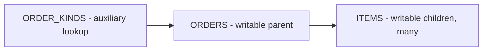
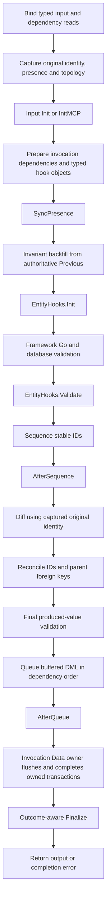
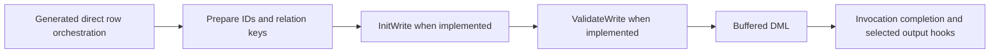
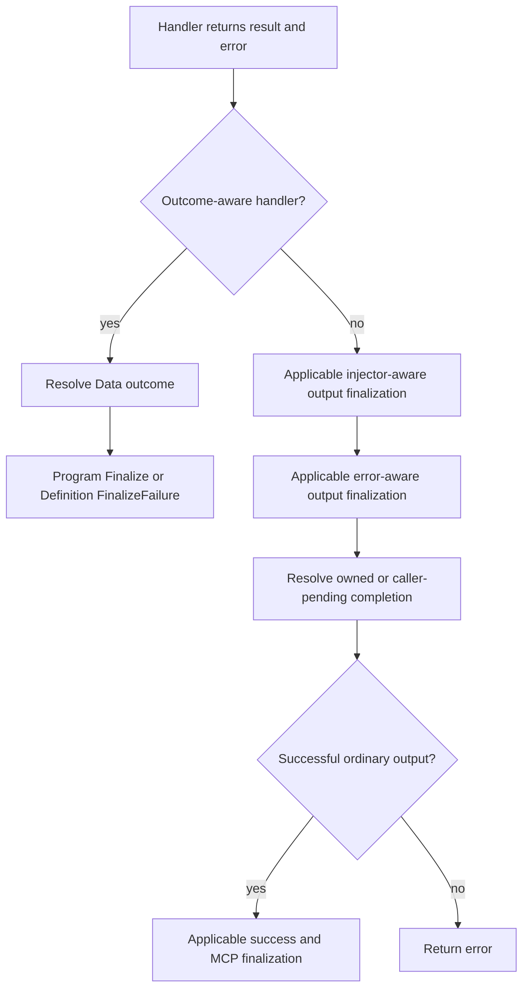

# Writer lifecycle: transcription, generated mutators and application behavior

[All guides](README.md) · [Programming model](programming-model.md) · [DQL grammar](dql.md) · [Reader/writer diagrams](hooks.md)

This guide follows a writer from authored DQL through generated code, request
binding, database comparison, hooks, transactions and response delivery. The
generated mutation policy emits pure Go code. Its typed handler, capture,
validation, sequencing and DML support execute as Go. Direct generated Go and
authored Go handlers use the same invocation capabilities with explicitly
selected orchestration. Reader generation is a separate choice; Datly does not automatically
generate a combined reader/writer component in one struct.

## Contents

1. [Choose the writer product](#choose-the-writer-product)
2. [Describe the writable graph](#describe-the-writable-graph)
3. [CLI generation and generated code](#cli-generation-and-generated-code)
4. [Understand the complete lifecycle](#understand-the-complete-lifecycle)
5. [Separate the four kinds of state](#separate-the-four-kinds-of-state)
6. [Use Has markers for sparse requests](#use-has-markers-for-sparse-requests)
7. [Understand SyncPresence](#understand-syncpresence)
8. [Backfill invariant groups](#backfill-invariant-groups)
9. [Customize the writing hooks](#customize-the-writing-hooks)
10. [Inject services and publish messages](#inject-services-and-publish-messages)
11. [Control errors](#control-errors)
12. [Shape custom output](#shape-custom-output)
13. [Understand finalizer selection](#understand-finalizer-selection)
14. [Sequence IDs and reconcile foreign keys](#sequence-ids-and-reconcile-foreign-keys)
15. [Regenerate and test](#regenerate-and-test)

## Choose the writer product

Select the write operation in the CLI and declare its matching HTTP route in DQL:

| CLI operation | Route method | Intent |
| --- | --- | --- |
| `-op patch` | `PATCH` | Apply supplied fields while preserving omitted values. |
| `-op post` | `POST` | Insert the writable graph. |
| `-op put` | `PUT` | Apply the generated update policy for the writable graph. |

Generation emits Go and creates the request/output contracts and state reads
needed by the operation. The route method alone does not generate that code.
For a sparse update, Datly matches the authorized previous database rows using
complete identities; the application authors the graph and lifecycle behavior.

A reader is generated separately with `-op get` and its own DQL/package. An
existing application handler remains an explicit alternative with its own
orchestration; it is not required for this generated-writer workflow.

## Describe the writable graph

Consider three tables:

| Table | Role | Relationship |
| --- | --- | --- |
| `ORDERS` | Writable parent | Full parent identity and scalar business fields |
| `ITEMS` | Writable children | Many items belong to an order through ORDER_ID |
| `ORDER_KINDS` | Auxiliary lookup | Supplies kind data; never a DML target |



The high-level PATCH generation input describes the graph and its field policies.
This is the same outer-view structure used for a reader. The selected operation
controls generation; writer annotations add behavior to its graph. Reader and
writer DQL are authored independently and can select different fields, relations
and filters.
Body contracts, key projections and Current-state declarations belong to the
**generated output**, not to the minimum hand-authored input:

```sql
#package('example.com/shop/orders/write')
#import('hooks', 'example.com/shop/hooks')
#setting($_ = $route('/orders', 'PATCH'))
#setting($_ = $connector('main'))
SELECT orders.*, items.*, kind.*,
       entity_hooks(orders, 'hooks.OrderLifecycle'),
       invariant(orders.WINDOW_START, 'DeliveryWindow'),
       invariant(orders.WINDOW_END, 'DeliveryWindow')
FROM (
    SELECT o.* FROM ORDERS o
) orders
LEFT JOIN (
    SELECT i.* FROM ITEMS i
) items ON items.ORDER_ID = orders.ID
LEFT JOIN (
    SELECT k.* FROM (ORDER_KINDS) k
) kind ON kind.ID = orders.KIND_ID AND 1=1
```

The database metadata supplies the real column types and keys. Use a start/end
date pair for WINDOW_START/WINDOW_END. The generator derives the request graph,
Previous reads and typed Go write support for the selected PATCH operation.
StructQL key projection is generated plumbing; the application should not need
to write a template loop to load Current rows.

The outer query defines the view graph: `orders`, `items` and `kind` are named
views, each supplied by its own subquery. The inner aliases `o`, `i` and `k` are
local to those SQL queries. Outer annotations address a view's projected column,
for example `orders.WINDOW_START`.

`FROM (ORDER_KINDS)` inside the `kind` view marks its source as auxiliary/nonmutating.
`AND 1=1` marks that joined relation as a single holder while keeping its real
key equality. The `items` view remains many. The generator must not infer that every joined
table is writable. Foreign-key constraints still belong to the database.

## CLI generation and generated code

Start each writer DQL with an explicit destination package declaration. The reader
uses its own package, for example `example.com/shop/orders/read`; the writer uses
`example.com/shop/orders/write`. The project root is the filesystem argument, while
DQL owns the Go package and shape declarations.

The tested high-level generation command has this form (CLI integration is still
under review in this development branch):

```sh
datly gen -op patch \
  -dir "$PROJECT" \
  -schema -connector main -driver sqlite3 -dsn "$PROJECT/orders.db" \
  example.com/shop/orders/source
```

`-dir` selects the existing project/module root. The final argument selects the
source package containing the DQL. `-op` selects the operation; `-schema` and the
connector options select the database metadata used for generation. The generator
emits pure Go into the package declared by DQL. Use separately authored reader DQL
and `-op get` for the reader; do not generate a combined reader/writer declaration.

This is a command-line workflow. Application authors should not need to construct
compiler objects, metadata registries, body contracts or Current queries in Go.


Original Datly separates `gen` from `translate`. The `gen` PATCH workflow
starts from the graph description, constructs the write contract and logic, then
passes its generated result through compilation/translation. Translating an
already-complete writer declaration is a lower-level operation.

The v1 high-level `gen` command is being restored and verified against that
workflow. Until it is ready, the existing `transcribe.Request` API must not be
presented as an equivalent convenience command: it requires lower-level inputs.
The step-by-step CLI walkthrough will use the verified generation path, with
pure Go as its primary output.

After generation, inspect the returned plan/file list, add business behavior to
the create-once Go hook file, build/link the component and run it. Do not create
a combined reader/writer component or manually recreate generated matching and
Current-state support.

The generated writer contains more than a request struct:

| Artifact concern | What the generated code does |
| --- | --- |
| Input/output | Binds authored request sources and defines the public response |
| View/entity types | Carries the typed writable graph and linked lookup values |
| Markers/setters | Represents supplied fields and marker-aware application changes |
| Original capture | Retains detached identity, presence and topology before initialization |
| Previous matching | Indexes authoritative database rows by full identity tuples |
| Invariants | Backfills declared business groups from known Previous fields |
| Hook bindings | Supplies typed entity/parent state and invocation-scoped dependencies |
| DML/actions | Sequences, diffs, reconciles and queues the selected writable tables |
| Component/resources | Connects routes, handler factory, SQL and embedded resources |
| Ownership records | Protects authored files and detects regeneration conflicts |

Exact file/type names come from the plan and authored naming settings. Edit the
create-once hook file rather than modifying private generated capture, matching
or DML code. Build and link the emitted package before publishing a runtime
generation. The generation step itself does not execute the business mutation.

## Understand the complete lifecycle

### Invocation and input hooks

1. Resolve the registered component and bind its declared inputs, codecs and
   dependencies. Current-state reader dependencies may run their own OnFetch and
   OnRelation hooks as part of those reads.
2. The generated mutation definition captures original input presence, identity
   and topology before initialization.
3. Run input `Init(context.Context) error` when implemented.
4. For an MCP invocation with the corresponding context, run
   `InitMCP(context.Context, mcp.Context) error` when implemented.
5. Execute the selected writer product with its invocation binder and Data owner.

Input Init and InitMCP are ordered hooks, not interchangeable alternative names.
A failure stops subsequent execution. The generated Program is invocation-local;
its immutable Definition can be shared by the runtime.

### Generated mutation policy


This is the optional generated mutation policy. Custom Go handlers can
compose the same capabilities with explicitly authored orchestration; the HTTP
verb alone does not install this policy.



Any failing phase stops later write phases. The invocation owner resolves failure
and transaction completion before outcome-aware finalization. A failed early
capture can reach `Definition.FinalizeFailure` without a prepared Program.
A caller-owned transaction remains pending from this invocation's perspective.

The order is implemented by the [mutation adapter](../runtime/handler/mutation/adapter.go)
and [generated policy phases](../transcribe/handler/golang/mutation_program.go).


### Direct generated Go row writing hooks

The direct generated row-writing path can call
`InitWrite(context.Context) error` and `ValidateWrite(context.Context) error` on
typed entities after the generated identity/link preparation and before DML.
These are not aliases for `EntityHooks[T,P].Init/Validate`: they belong to a
different generated orchestration seam. Custom handlers must invoke the policy
and capabilities they intend to use.



The SDK also declares `WriteHook.BeforeWrite`; the current generated mutation
Program does not dispatch it. Use the supported EntityHooks Init/Validate and
sequence/queue observations shown above, or explicitly author custom orchestration.

## Separate the four kinds of state

| State | Source | Meaning |
| --- | --- | --- |
| Original presence/identity | Detached capture before input Init | What the client supplied and how the original operation is classified |
| Working values/markers | Bound and subsequently prepared entity | What validation, sequencing and DML currently process |
| Previous row | Authored database Current read | Existing database values for comparison/backfill |
| Previous field evidence | Completed typed read projection | Which Previous fields are known, rather than omitted from that read |

An initialized or sequenced ID does not turn an originally new entity into an
update. A Previous row is not the original request snapshot. Unknown Previous
fields are not known zero values. These distinctions remain important in nested
and self-referencing graphs.

## Use Has markers for sparse requests

These order-entity fragments have different meanings:

```json
{"id": 1}
```

```json
{"id": 1, "note": null, "items": [{"id": 11, "quantity": 0}]}
```

The first does not request a Note or child update. The second explicitly supplies
a null Note and a zero Quantity for item 11. Go values alone cannot preserve
that distinction, so the generated shape carries
Has/set-marker information alongside the working fields.

- Omitted means the client did not request replacement of that field.
- Explicit null remains supplied and must be validated as null.
- Zero and false remain supplied, valid values where business/database rules permit.
- Has is internal metadata, excluded from SQL and public JSON/MCP schemas.
- Original presence is captured separately from mutable working Has markers.

Use `state.Original.Has("Note")` to ask about client intent. Use the working
marker or a generated setter to manage a deliberate application change. Field
names in these contracts are canonical Go field names, not guessed SQL aliases.

## Understand SyncPresence

Input initialization can modify a working value after original capture.
`SyncPresence` compares the working graph against that original baseline and
marks permitted non-identity changes without rewriting original intent.

For example, input Init fills an omitted Note with a default. Synchronization
can mark the working Note for persistence while Original.Has("Note") remains
false. An explicitly supplied zero stays supplied even if the value is unchanged.

Generated owned entities may expose `entity.SyncPresence(snapshot)` as a typed
delegate to `handler.EntitySnapshot[T].SyncPresence(entity)`. The mutation Program
runs this phase. It is not a SQL update, database reload or commit operation.

Synchronization verifies captured associations and fails on ambiguous or changed
topology. It does not silently rematch by an incomplete identity prefix. Marker
changes are not partially applied when synchronization fails. Hooks running after
this phase should use the generated marker-aware setters for business changes;
do not expect a later hidden SyncPresence pass to repair arbitrary direct writes.

## Backfill invariant groups

The outer `invariant` annotations place WINDOW_START and WINDOW_END in the
DeliveryWindow group; generated Go fields carry `invariant:"DeliveryWindow"`.
A PATCH may supply only WindowStart, but validation needs a complete interval.
Invariant backfill restores missing group values from the authoritative Previous
row where the policy allows it, before EntityHooks.Init and Validate.

Backfilling WindowEnd does not mean the client supplied WindowEnd. New inserts
cannot borrow a nonexistent Previous row. Missing read evidence must not be
interpreted as a loaded default. Invariant preparation and database constraints
are complementary: SQL NOT NULL rejects null, not every zero or false value.

### Start/end date example

For date/time fields, the invariant is chronological. Suppose the database has:

```json
{"id": 1, "windowStart": "2026-09-14T09:00:00Z", "windowEnd": "2026-09-16T17:00:00Z"}
```

A sparse entity update supplies only the new start:

```json
{"id": 1, "windowStart": "2026-09-15T09:00:00Z"}
```

Invariant backfill supplies the known Previous WindowEnd for validation. The
working interval is valid, and Original.Has("WindowEnd") remains false. Moving
the start to `2026-09-17T09:00:00Z` instead must fail validation and leave the
stored interval unchanged. With pointer-valued `time.Time` fields, compare using
`row.WindowStart.After(*row.WindowEnd)`, not numeric ordering operators.
The GEN PATCH acceptance gate must verify the actual generated date shape and setters.

## Customize the writing hooks

The attached Go struct holds application business rules for one view's rows.
Datly invokes its methods during generated write processing; Datly continues to
own snapshot matching, sequencing, diffing, queued SQL and transaction handling.
The struct name is application-defined, not a required framework suffix.

| Method | Purpose |
| --- | --- |
| `Init` | Apply application defaults or normalize business values using marker-aware setters. |
| `Validate` | Check the effective row, including invariant backfill, without changing it. |
| `AfterSequence` | Run after IDs have been assigned and before diffing; preserve validated business values. |
| `BeforeWrite` | Customize business values in the supported pre-validation phase, with the planned action. |
| `AfterQueue` | Observe successfully queued work; this does not mean the transaction committed. |

`Init` and `Validate` form the current required contract. The other methods are
optional capabilities on the same invocation-scoped object. Commit-dependent
side effects belong in outcome-aware finalization.

An authored root hook can have this shape, with application Order/Input types:

```go
type OrderLifecycle struct {
    Input *Input `bind:"kind=input,required"`
    Bus handler.MessageBus `bind:"kind=mbus,required"`
}

func (h *OrderLifecycle) Init(ctx context.Context, row *Order,
    state handler.EntityState[Order, handler.NoParent]) error {
    // Apply defaults with generated marker-aware setters.
    return nil
}

func (h *OrderLifecycle) Validate(ctx context.Context, row *Order,
    state handler.EntityState[Order, handler.NoParent]) error {
    if row.WindowStart != nil && row.WindowEnd != nil &&
        row.WindowStart.After(*row.WindowEnd) {
        return fmt.Errorf("start must not exceed end")
    }
    return nil
}
```

The default scaffold uses an entity-based name such as `OrderLifecycle` and
contains empty lifecycle methods, each with only `return nil`. It supplies the
signatures; application code supplies the behavior. Auxiliary views do not receive
mutation lifecycle scaffolds. If one entity type appears in different parent roles,
the generated names must distinguish their different typed contracts.

Scaffold files are create-once: regeneration preserves application edits. An
explicitly supplied lifecycle type takes precedence. Keep the scaffold's actual
method signatures. For an existing application hook type, declare
`entity_hooks(orders, 'hooks.OrderLifecycle')` in the outer projection, with
`#import('hooks', 'example.com/shop/hooks')` declaring the package. The import
identifies the Go package; `hooks.OrderLifecycle` identifies its hook struct. Child hooks
use `EntityState[Child, Parent]`; root hooks use `NoParent`. SelfParent identifies
a recursive parent independently of the enclosing relation Parent.

The hook object is invocation-scoped and reused across its phases. Validate must
not change business values, markers or Previous snapshots. Optional AfterSequence
and AfterQueue callbacks observe their corresponding phase; they are not another
unrestricted mutation pass.

## Inject services and publish messages

The bus field's `bind:"kind=mbus,required"` requests a configured invocation bus.
The host supplies the actual `handler.MessageBus` capability. A binding tag does
not connect to a broker or allow a client to replace the service implementation.
The same mechanism can supply configured input, logger and other scoped services.

The root typed hook can implement the outcome finalizer:

```go
func (h *OrderLifecycle) Finalize(ctx context.Context, input *Input,
    output *Output, outcome handler.Outcome) error {
    if !outcome.CommitConfirmed() {
        return nil
    }
    payload := buildOrderEvent(input) // Use final reconciled IDs.
    _, err := h.Bus.Push(ctx, h.Bus.Message("orders.changed", payload))
    return err
}
```

This is `handler/mutation.Finalizer[Input,Output]`. Record business event intent
during the earlier phases and form the final payload after IDs/links are stable.
Do not publish commit-dependent messages from Validate or AfterQueue. A bus
failure after commit cannot roll back that commit; after-commit publication alone
is not an atomic outbox or exactly-once delivery mechanism.

## Control errors

Use input declaration metadata for binding failures, and return errors from
business callbacks for operation failures. A typed public body can be returned
with `response.Error`:

```go
return &response.Error{
    Code: 422,
    Payload: Problem{Code: "invalid_window", Message: "start must not exceed end"},
    Cause: err,
}
```

Import `github.com/viant/xdatly/response`; Problem and err are application values.
Keep internal diagnostics in Cause and deliberately public fields in Payload.
Framework validation runs before custom validation in the generated policy.
Final produced-value validation runs after reconciliation and before Queue.
A phase error stops later phases; a flush error produces an unsuccessful outcome.
Do not turn an error into success solely by setting an HTTP response code.

## Shape custom output

Output is separate from the input and writable graph. DQL output declarations
and `output_type` select its contract. A writer can return changed rows, an
acknowledgement envelope, a summary or another authored shape. The handler and
applicable finalizer populate that contract; Has markers remain internal.

For application-produced final bytes, return a supported `response.Response`,
such as `response.NewBuffered(response.WithBytes(...), response.WithHeader(...))`.
The HTTP adapter writes that body directly instead of marshaling the buffer into
JSON. Describe media type/status/headers/schema/examples explicitly for API docs.
See [errors and custom output](errors-and-output.md) for complete response examples.

## Understand finalizer selection

Finalizers are selected contracts, not a list that always runs for every result.
The different output `Finalize` signatures are alternatives on a Go type;
`FinalizeMCP` is a separately named capability:

| Contract | Position and responsibility |
| --- | --- |
| Runtime `OutcomeFinalizer` / generated mutation Finalize | Observes the resolved data outcome; replaces ordinary output finalizers for that handler |
| Output `Finalize(ctx, InjectorLookup)` | Conditional child-component work before completion; children share the root unit of work |
| Output `Finalize(ctx, err)` | Error-aware, before completion; preserves the operation error and can prevent an owned commit |
| Output `Finalize(ctx)` | Success-only, after owned completion; not additionally called when an error/injector-aware output contract was selected |
| Output `FinalizeMCP(ctx, mcp.Context)` | Applicable MCP success hook in the ordinary output lifecycle |
| Definition `FinalizeFailure` | Handles failure when a generated Program is unavailable; input/output may be nil |



An injector can resolve a specific component and bind its result conditionally.
Do not retain its binder beyond the Finalize call or launch unawaited work with
it. Its child DML participates in the root outcome. Nested success callbacks wait
for their parent outcome rather than announcing success at a child seal.

## Sequence IDs and reconcile foreign keys

Stable identities are allocated before Queue. Pending supplied identities must
be visible to allocation so generated IDs do not collide with the request.
AfterSequence observes allocated IDs; diffing still uses captured original identity.
Reconciliation repairs the exact parent-child links before final validation/DML.

An originally absent child FK may be deferred only for its exact captured parent
INSERT. Parent UPDATE does not authorize that deferral. Supplied null/zero remains
supplied; a hook changing the working value cannot erase the original intent.
Final Go/NULL/UNIQUE/reference validation runs with no remaining field deferral.
Pending-parent references require unchanged topology, verified INSERT decisions,
parent-before-child order and native matching of the actual SQL-bound values.

Composite identities compare the complete tuple. Native metadata support is not
universal constraint discovery; authored UNIQUE/reference constraints remain
important when a driver cannot report them. Do not infer the absence of a database
constraint from missing discovery metadata.

## Transactions and async execution

Data combines buffered DML, sequencing and flush capabilities. A locally owned
transaction is completed by its owner. Flushing into a supplied transaction does
not transfer commit ownership. Caller-pending, failure and unknown completion
must not be reported as confirmed commits.

Async execution persists a job and replays through the same component/binding
owners. It does not create a second writer engine or authorize serialized claims.
Reader dry-run query preparation is not a general mutation side-effect sandbox.
See [async jobs](async.md) for replay and completion boundaries.

## Regenerate and test

Re-transcribe after schema or projection changes, inspect the generated diff and
rebuild/link the component. Keep create-once application hooks and protected
edits. Regeneration updates proven generated fields, including pointer/value
changes and dropped projection columns, without silently overwriting authored code.

Test the behavior the API promises:

- Sparse updates preserve omitted fields and distinguish null/zero/false.
- Partial invariants obtain only known Previous values and reject invalid groups.
- Mixed insert/update parents and children receive complete IDs and links.
- The auxiliary table receives no DML.
- Validation, AfterQueue and flush failures prevent confirmed success.
- Caller-pending work does not publish commit-dependent messages.
- Regeneration preserves application hook edits and the correct selected product.
- HTTP/MCP output, errors, authorization and custom response bodies match their contracts.

The implementation references are the [canonical engine](../runtime/handler/engine/engine.go),
[mutation adapter](../runtime/handler/mutation/adapter.go),
[generated program](../transcribe/handler/golang/mutation_program.go) and
[generated write-hook tests](../transcribe/write_hooks_parity_test.go).
Check [release status](status.md) for open integration gates; a grammar parse or
successful build alone does not establish every runtime behavior.
