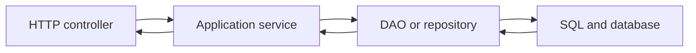
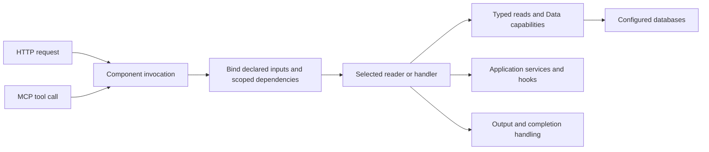
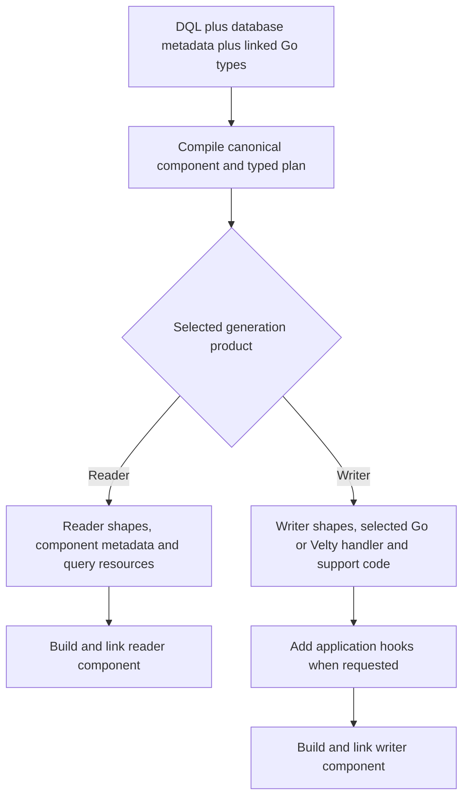

# From DAO and service layers to Datly components

[All guides](README.md) · [DQL grammar](dql.md) · [Transcription](authoring.md) · [Generated mutators](generated-mutator.md)

Datly's programming model combines a declared data contract with generated code,
scoped capabilities and explicit application behavior. Understanding those pieces
is more useful than treating it as an ORM or a list of hook interfaces.

## Start with the familiar application

A conventional application often gives each layer a separate responsibility:



The controller binds request values and shapes responses. The service applies
business policy and coordinates dependencies. The DAO issues SQL and maps rows.
Across many endpoints, application code also repeats parameter validation,
relationship loading, pagination, transaction plumbing and error translation.

Datly makes much of that data execution and transport contract declarative. It
still needs application business rules; those can live in reusable services,
custom handlers and typed hooks supplied through dependency injection.

## The component is the application boundary

A component declares the operation the application exposes: its identity/routes,
input, output, data views or handler, dependencies and metadata. HTTP and MCP
invoke that component through the same execution model.



A reader component and a writer component are separate operations. They may
share domain shapes, connectors and services, but generation does not automatically
create a combined Reader/Writer declaration in one struct. A handwritten Go
container can explicitly group multiple declarations; that is an authoring choice,
not the default meaning of transcription.

## DQL describes the data operation

DQL combines SQL with Datly-specific declarations. SQL selects data; DQL supplies
route, binding, type, relationship and generation authority around it.

```sql
#setting($_ = $route('/orders', 'GET'))
#setting($_ = $connector('main'))
#define($_ = $CustomerID<int>(query/customerId).Required())
SELECT o.ID, o.CUSTOMER_ID, o.TOTAL
FROM ORDERS o
WHERE o.CUSTOMER_ID = :CustomerID
```

This reader fragment declares an input binding and a parameterized query. It
requires the named connector/table and does not itself establish that the caller
is authorized for that customer. Add the declared verified identity/predicate
contract where needed. DQL declarations are metadata, not extra SQL commands.

[The grammar reference](dql.md) explains settings, parameters, type expressions,
view controls, rich CASTs, hooks, auxiliary joins and template fragments.

## Transcription turns the contract into code and resources

Transcription resolves the authored DQL, Go types and database column metadata,
checks the structural contract, and creates the selected generation product.
Reader and writer generation must be selected and explained separately:



The graph shows alternative generation paths, not a request to emit both products
at once. A project may intentionally contain multiple separately authored components.

Generated artifacts can include:

- Input/output contracts and view/entity types, when those are generator-owned.
- Component metadata connecting the authored routes to the typed contract.
- SQL, template and other declared resources, with generated embedding support.
- A selected Go/Velty writer handler and typed mutation support.
- Create-once application hook scaffolds when requested.
- Ownership/fingerprint information used to protect regeneration.

Linked application types retain their existing owner. The exact files depend on
the selected product and DQL names/destinations. Transcription, compiling the Go
program and publishing a runtime generation are separate steps.

## Schema-to-code synchronization

Database metadata refines the generated shape; DQL retains explicit authority for
names, rich types and projection choices. Re-run transcription when schema or
DQL changes. Regeneration can propagate value/pointer changes and remove fields
that disappeared from a generator-owned projection while preserving protected
application code.

This cycle replaces manual synchronization between SQL, DTOs and endpoint
contracts. It is not an implicit database schema watcher. Inspect diagnostics
and generated diffs, rebuild/link the code, then publish the new generation.
Request-time data changes and writer Previous-state comparison are separate concerns.

## SQL and StructQL have different jobs

| Mechanism | Data source | Typical purpose |
| --- | --- | --- |
| SQL | Configured database | Fetch current records, joins, aggregates and reference data |
| StructQL | An already available typed Go object graph | Project keys/values and prepare typed lookup or comparison data |
| Velty | A compiled template with declared values/capabilities | Expand parameterized query fragments or orchestrate explicitly supplied services |
| Generated Go | Typed compiled application artifacts | Execute the selected reader/writer support with normal Go type checking |

For example, StructQL can project order IDs from an incoming Orders graph:

```sql
#define($_ = $OrderKeys<?>(param/OrderKeys) /*
 SELECT Id FROM /Orders
*/)
```

`/Orders` is a declared object-graph path, not a database table. That projection
can help an authored database Current query fetch the relevant previous rows.
The actual graph field names and supported StructQL types must match the input.
StructQL does not replace SQL or create another database-access layer.

## What happens to service and DAO responsibilities?

| Responsibility | Datly owner | Application role |
| --- | --- | --- |
| Request decoding, required inputs, codecs | Canonical binding and input contract | Declare sources, types and safe failure metadata |
| SQL parameterization and typed row mapping | SQL reader and native SQLX | Author queries/projections and choose connectors |
| Selected relationships and query controls | View planning and reader execution | Declare relations and allowed selectors |
| Business rules and external dependencies | Custom handlers, services and scoped hooks | Implement the domain policy |
| Sparse mutation comparison | Generated typed policy plus Previous evidence | Declare writable graph, identity and invariants |
| Sequencing and buffered DML | Invocation Data capabilities | Request capabilities; do not invent competing transaction ownership |
| Transport output and errors | Typed output, finalizers and gateway adapters | Author public shape, status and message policy |

Existing business services can remain useful. Inject them into a handler or hook;
Datly need not absorb domain logic into SQL. Likewise, a custom orchestration can
use the scoped Data capability without pretending that every application follows
the generated mutation policy.

## A writer is more than an INSERT statement

The generated mutator preserves original request intent, loads authoritative
Previous state, synchronizes working presence, backfills invariant groups,
validates, sequences IDs, computes differences, reconciles foreign keys and queues
DML. Its typed hooks expose business customization at defined phases.

An auxiliary lookup source contributes data but is not a writable target. A
one-to-many child relation is a typed collection with its own identity and links.
The policy must not turn every joined table into DML. See
[generated mutators](generated-mutator.md) and [hook-flow diagrams](hooks.md).

## Dependency injection is part of execution

The invocation supplies only configured capabilities: input, logger, message bus,
read dependencies, Data and other registered services. A hook field such as
`Bus handler.MessageBus` with `bind:"kind=mbus,required"` requests the supplied bus.
The tag neither creates a broker nor accepts a replacement service from a client.

This lets one typed hook combine domain services with current entity/parent state.
For commit-dependent publication, collect event intent during business processing
and publish only in outcome-aware finalization after confirmed commit.

## Output is a contract of its own

A reader projection, writer input and public response need not have identical
shapes. Declare an output contract, populate or enrich it through the selected
handler/finalizer, and describe it for HTTP/MCP. For final bytes, use the transport
response contract rather than serializing a buffer object.

See [errors and custom output](errors-and-output.md). Cubes and composition build
on declared readers for analytical interfaces; [reports](reports.md) describes
frames, dimensions, measures, grouping and their deployment boundaries.
