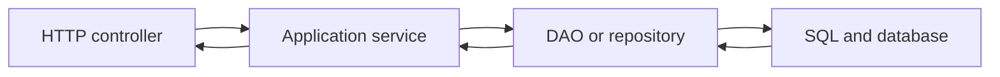
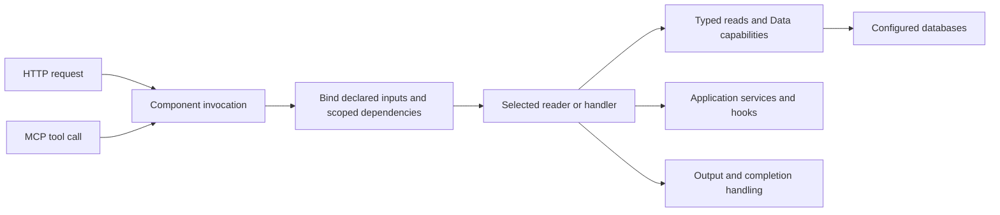
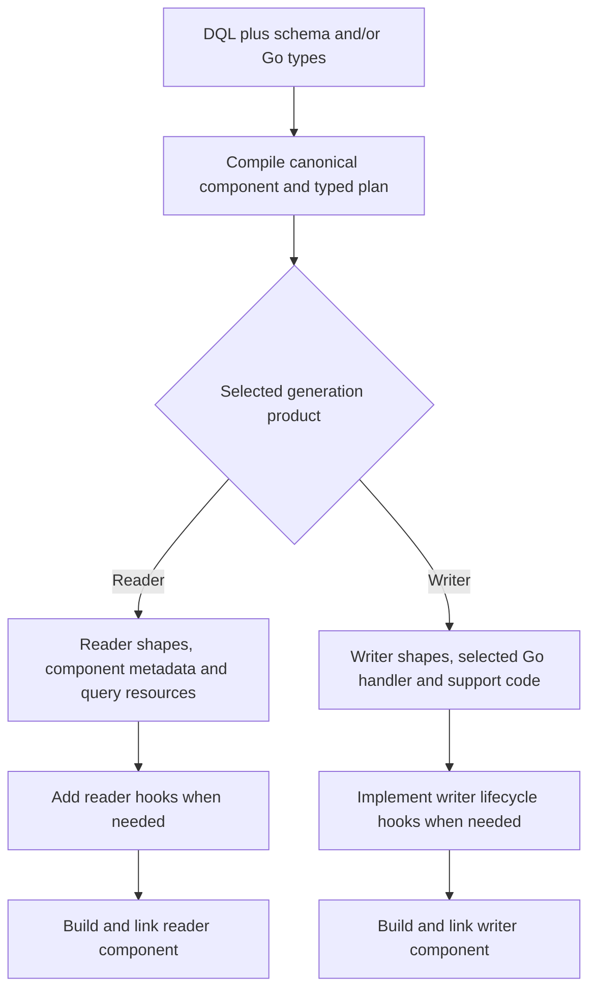

# From DAO and service layers to Datly components

[All guides](README.md) · [DQL grammar](dql.md) · [Transcription](authoring.md) · [Generated mutators](generated-mutator.md)

Datly's programming model combines a declared data contract with generated code,
scoped capabilities and explicit application behavior. Understanding those pieces
is more useful than treating it as an ORM or a list of hook interfaces.

## Start with the familiar application

A conventional application often gives each layer a separate responsibility:



The controller binds request values and shapes responses. The service applies
business policy and coordinates dependencies. The DAO issues SQL and maps rows.
Across many endpoints, application code also repeats parameter validation,
relationship loading, pagination, transaction plumbing and error translation.

Datly makes much of that data execution and transport contract declarative. It
still needs application business rules; those can live in reusable services,
custom handlers and typed hooks supplied through dependency injection.

## The component is the application boundary

A component declares the operation the application exposes: its identity/routes,
input, output, data views or handler, dependencies and metadata. HTTP and MCP
invoke that component through the same execution model.



A reader component and a writer component are separate operations. They may
share domain shapes, connectors and services, but generation does not automatically
create a combined Reader/Writer declaration in one struct. A handwritten Go
container can explicitly group multiple declarations; that is an authoring choice,
not the default meaning of transcription.

## DQL describes the data operation

DQL combines SQL with Datly-specific declarations. SQL selects data; DQL supplies
route, binding, type, relationship and generation authority around it.

```sql
#package('example.com/shop/orders/read')
#setting($_ = $input_type('OrdersInput'))
#setting($_ = $output_type('OrdersOutput'))
#setting($_ = $case_format('lc'))
#setting($_ = $route('/orders', 'GET'))
#setting($_ = $connector('main'))
#define($_ = $CustomerID<int>(query/customerId).Required())
#define($_ = $Orders<[]*Order>(output/view))
SELECT orders.*, type(orders, 'Order')
FROM (
    SELECT o.ID, o.CUSTOMER_ID, o.TOTAL
    FROM ORDERS o
    WHERE o.CUSTOMER_ID = :CustomerID
) orders
```

`output_type('OrdersOutput')` names the response struct. It does not, by itself,
specify a result field. The explicit `Orders<[]*Order>(output/view)` declaration
binds the main query result—the `orders` root view—to its `Orders` field.
`type(orders, 'Order')` names each row's Go shape; `[]*Order` makes the result a
collection. The component-wide `case_format('lc')` policy makes the holder
`orders` and applies lower-camel casing to nested row fields through the
Structology JSON marshaler. No per-field JSON tags are needed.

The public shape is equivalent to the following; the generated `output.go` also
contains the binding, view, and SQL-resource tags used to populate it:

```go
type OrdersOutput struct {
    Orders []*Order
}
```

For one matching row, the response is:

```json
{"orders":[{"id":42,"customerId":7,"total":125.5}]}
```

Shape the response explicitly at two levels:

- Choose the output holder in DQL. Declaring `Data<[]*Order>(output/view)` instead
  of `Orders<[]*Order>(output/view)` creates a `Data` field and a `data` envelope
  under the same lower-camel policy.
- Select the desired row columns in the outer DQL. Selecting only `orders.ID`
  and `orders.TOTAL` creates a narrower row shape; the inner query can still use
  `CUSTOMER_ID` for filtering. Use the global case policy for consistent wire
  names rather than annotating every column with a JSON tag.

The named input and output types also identify the reader's request/output hook
receivers: `OrdersInput.Init` and `OrdersOutput.Finalize`. Row processing such as
`OnFetch` belongs to the row type. See [reader hooks](hooks.md) and
[custom output](errors-and-output.md#shape-an-ordinary-typed-output).

This reader fragment declares an input binding and a parameterized query. It
requires the named connector/table and does not itself establish that the caller
is authorized for that customer. Add the declared verified identity/predicate
contract where needed. DQL declarations are metadata, not extra SQL commands.

[The grammar reference](dql.md) explains settings, parameters, type expressions,
view controls, rich CASTs, hooks, auxiliary joins and template fragments.

## Transcription turns the contract into code and resources

Transcription resolves the authored DQL with database schema and/or Go types,
checks the structural contract, and creates the selected generation product.
Reader and writer generation must be selected and explained separately:



The graph shows alternative generation paths, not a request to emit both products
at once. A project may intentionally contain multiple separately authored components.

From an existing project module, select the source package and operation:

```sh
datly transcribe get -dir "$PROJECT" \
  -schema -connector main -driver sqlite3 -dsn "$PROJECT/orders.db" \
  example.com/shop/source/read
```

Save the reader DQL in that source package. For a writer, author separate DQL in
`example.com/shop/source/write`, declare `#package('example.com/shop/orders/write')`
and the matching route, then use `patch`, `post` or `put`. `#package` is required
for high-level DQL generation; input/output type settings name contracts and
outer `type` annotations name entity shapes. Plain filenames such as `views.go`,
`input.go`, `output.go` and `router.go` are defaults; optional `file_prefix` applies
only to defaults, while explicit destinations win. Application writer hooks live
in create-once `lifecycle.go`. See [filename controls](dql.md#generated-filenames-and-destinations).

Generated artifacts can include:

- Input/output contracts and view/entity types, when those are generator-owned.
- Component metadata connecting the authored routes to the typed contract.
- SQL, template and other declared resources, with generated embedding support.
- A selected Go writer handler and typed mutation support.
- Create-once application hook scaffolds when requested.
- Ownership/fingerprint information used to protect regeneration.

Linked application types retain their existing owner. The exact files depend on
the selected product and DQL names/destinations. Transcription, compiling the Go
program and publishing a runtime generation are separate steps.

For writers, Original captures client values/presence before input initialization.
Input.Init can resolve identity using generated typed read indexes; the authorized
Previous match and known key parts then freeze before entity Init and sequencing.
Sparse Has markers govern working changes independently of Original. Canonical
key/link indexes are prepared eagerly; business `GroupBy…()`/`IndexBy…()` helpers
run on demand. Follow the [complete writer lifecycle](mutations.md).

Inner SQL, including CTEs, stays source-preserved. Driver result metadata supplies
output names/existence; outer CAST supplies explicit Go type authority even for
computed outputs without driver types. Simple `''`/`0` projections default to
`string`/`int`. Keep internal physical columns SQL-mapped; `sqlx:"-"` explicitly
excludes a logical pseudo field from SQL/DML. See [CAST and mapping](dql.md#rich-cast-pseudo-fields-and-tag-customization).

## Application hooks on readers and writers

Both component kinds provide application extension points. Add reader hooks when
fetched rows or assembled relations need application behavior, just as writer
lifecycle methods supply behavior around a mutation.

| Component | Application hook | When it runs |
| --- | --- | --- |
| Reader | `OnFetch(ctx) error` | After a typed row is populated, before indexing and relation assembly. An error fails the fetch. |
| Reader | `OnRelation(ctx)` | After selected child relations are assembled. This notification has no error return. |
| Writer | `OrderLifecycle.Init` / `Validate` | During initialization and validation of the effective mutation state. |
| Writer | `AfterSequence` / `AfterQueue` | After ID sequencing or after DML is queued; queueing does not confirm commit. |

Reader row hooks are methods on the row type. Keep application methods in a
separate authored Go file in that type's package:

```go
func (order *Order) OnFetch(ctx context.Context) error {
    return nil
}

func (order *Order) OnRelation(ctx context.Context) {
}
```

The generated writer uses its separate, typed lifecycle struct. Both readers and
writers can also use the applicable input initialization and output finalization
hooks. Their method contracts and execution order reflect the operation; see the
[reader and writer sequence diagrams](hooks.md).

## Schema-to-code synchronization

Database metadata refines the generated shape; DQL retains explicit authority for
names, rich types and projection choices. Re-run transcription when schema or
DQL changes. Regeneration can propagate value/pointer changes and remove fields
that disappeared from a generator-owned projection while preserving protected
application code.

This cycle replaces manual synchronization between SQL, DTOs and endpoint
contracts. It is not an implicit database schema watcher. Inspect diagnostics
and generated diffs, rebuild/link the code, then publish the new generation.
Request-time data changes and writer Previous-state comparison are separate concerns.

## From a DQL graph to generated DML

For a PATCH component, describe the writable views and their relationships in the
outer query. Keep each view's database SQL inside its subquery:

```sql
#package('example.com/shop/orders/write')
#setting($_ = $input_type('OrdersInput'))
#setting($_ = $output_type('OrdersOutput'))
#setting($_ = $case_format('lc'))
#setting($_ = $route('/orders', 'PATCH'))
#setting($_ = $connector('main'))
#define($_ = $Data<[]*Order>(output/body))
SELECT orders.*, items.*, kind.*,
       type(orders, 'Order'), type(items, 'Item'), type(kind, 'Kind'),
       lifecycle_type(orders, 'OrderLifecycle'),
       lifecycle_type(items, 'ItemLifecycle'),
       invariant(orders.WINDOW_START, 'DeliveryWindow'),
       invariant(orders.WINDOW_END, 'DeliveryWindow')
FROM (
    SELECT o.* FROM ORDERS o
) orders
LEFT JOIN (
    SELECT i.* FROM ITEMS i
) items ON items.ORDER_ID = orders.ID
LEFT JOIN (
    SELECT k.* FROM (ORDER_KINDS) k
) kind ON kind.ID = orders.KIND_ID AND 1=1
```

Generate the Go writer from the source package containing that DQL:

```sh
datly transcribe patch \
  -dir "$PROJECT" \
  -schema -connector main -driver sqlite3 -dsn "$PROJECT/orders.db" \
  example.com/shop/source/write
```

The high-level CLI is available in the `v1` source tree. See
[the writer guide](mutations.md#cli-generation-and-generated-code) for project
setup, emitted artifacts and lifecycle customization.

The graph describes intent. Generated Go derives request contracts and authorized
Previous reads, tracks supplied fields, compares existing rows, sequences new IDs,
and queues the necessary INSERT/UPDATE operations. ORDERS and ITEMS are mutable;
ORDER_KINDS is auxiliary data for application logic and receives no DML. Sparse
updates preserve omitted values, while the DeliveryWindow invariant supplies the
effective start/end pair for validation.

The explicit output declaration binds the mutation result to `OrdersOutput.Data`;
the global case policy names that envelope `data`. The auxiliary kind view remains
available for application logic through the graph rather than becoming a separate
top-level output holder.

Add business behavior to the explicitly declared `OrderLifecycle` and
`ItemLifecycle` scaffolds. Their methods initially return `nil`, and regeneration preserves the
application's edits. Authors do not hand-write key-extraction queries, Current
bindings, template loops or mutation orchestration for this standard workflow.
Omit a view's `lifecycle_type` declaration when it needs no lifecycle implementation;
transcription does not infer an application lifecycle type name.

## What happens to service and DAO responsibilities?

| Responsibility | Datly owner | Application role |
| --- | --- | --- |
| Request decoding, required inputs, codecs | Canonical binding and input contract | Declare sources, types and safe failure metadata |
| SQL parameterization and typed row mapping | SQL reader and native SQLX | Author queries/projections and choose connectors |
| Selected relationships and query controls | View planning and reader execution | Declare relations and allowed selectors |
| Business rules and external dependencies | Custom handlers, services and scoped hooks | Implement the domain policy |
| Sparse mutation comparison | Generated typed policy plus Previous evidence | Declare writable graph, identity and invariants |
| Sequencing and buffered DML | Invocation Data capabilities | Request capabilities; do not invent competing transaction ownership |
| Transport output and errors | Typed output, finalizers and gateway adapters | Author public shape, status and message policy |

Existing business services can remain useful. Inject them into a handler or hook;
Datly need not absorb domain logic into SQL. Likewise, a custom orchestration can
use the scoped Data capability without pretending that every application follows
the generated mutation policy.

## A writer is more than an INSERT statement

The generated mutator preserves original request intent, loads authoritative
Previous state, synchronizes working presence, backfills invariant groups,
validates, sequences IDs, computes differences, reconciles foreign keys and queues
DML. Its typed hooks expose business customization at defined phases.

An auxiliary lookup source contributes data but is not a writable target. A
one-to-many child relation is a typed collection with its own identity and links.
The policy must not turn every joined table into DML. See
[generated mutators](generated-mutator.md) and [hook-flow diagrams](hooks.md).

## Dependency injection is part of execution

The invocation supplies only configured capabilities: input, logger, message bus,
read dependencies, Data and other registered services. A hook field such as
`Bus handler.MessageBus` with `bind:"kind=mbus,required"` requests the supplied bus.
The tag neither creates a broker nor accepts a replacement service from a client.

This lets one typed hook combine domain services with current entity/parent state.
For commit-dependent publication, collect event intent during business processing
and publish only in outcome-aware finalization after confirmed commit.

## Output is a contract of its own

A reader projection, writer input and public response need not have identical
shapes. Declare an output contract, populate or enrich it through the selected
handler/finalizer, and describe it for HTTP/MCP. For final bytes, use the transport
response contract rather than serializing a buffer object.

See [errors and custom output](errors-and-output.md). Cubes and composition build
on declared readers for analytical interfaces; [reports](reports.md) describes
frames, dimensions, measures, grouping and their deployment boundaries.
