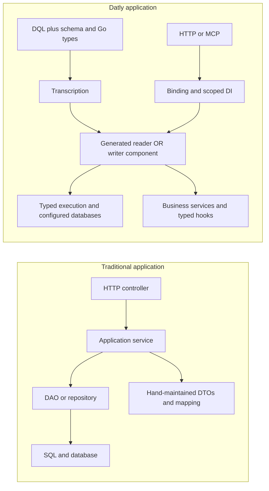

**High-performance data APIs, graphs and workflows.**

**Keep database schemas, generated code and API contracts aligned.** Datly's
schema-aware transcription turns DQL and database metadata into typed Go shapes,
resources and component contracts. Regenerate as projections and schemas evolve:
carry type/nullability changes forward, remove generator-owned fields no longer
projected, and preserve authored hooks and protected edits.

Datly is a programmable data application platform that connects databases,
business logic and delivery. Compose typed data graphs across databases,
orchestrate reads and mutations with scoped dependency injection, and expose
the same application contracts through HTTP APIs and MCP tools for AI agents.

Build rich relational views, transactional workflows and composable analytical
cubes. Extend their behavior with Go handlers, row-reading hooks,
typed mutation hooks and lifecycle finalizers. Inputs, authorization predicates,
validation and invocation capabilities flow through a shared execution model.

Datly's execution path combines compiled metadata, typed row processing and
native SQLX readers with configurable caching, dedicated cache warmup and
asynchronous jobs. Native timing records and optional OpenTelemetry export help
you measure the workloads you actually run.

From a single endpoint to a data-driven service spanning multiple databases,
Datly brings query execution, dependency injection, business workflows, analytics
and API delivery into one programmable platform.

**Start here:** [Programming model: DAO/service → components](references/product/datly/doc/programming-model.md) · [DQL and grammar](references/product/datly/doc/dql.md) · [Reader/writer hook flows](references/product/datly/doc/hooks.md) · [Generated mutators](references/product/datly/doc/generated-mutator.md) · [Errors and output](references/product/datly/doc/errors-and-output.md) · [Transcription](references/product/datly/doc/authoring.md) · [All guides](references/product/datly/doc/README.md)

## From DAO/service layers to generated components

A conventional application coordinates controllers, services, DAOs, SQL and DTOs.
Datly makes the data contract and execution plan explicit, then generates the
selected component artifacts while keeping business behavior in Go and
scoped services.



| Concern | Conventional DAO/service application | Datly component model |
| --- | --- | --- |
| Data contract | SQL, DTOs and request mapping maintained across layers | DQL/schema/type authority drives typed generation and regeneration |
| Reads | DAO mapping plus service-side relationship assembly | Declared views, typed data graphs and per-view query controls |
| Writes | Application-managed comparison and persistence orchestration | Explicit generated mutation policy or custom Go orchestration |
| Business behavior | Services and callbacks | Reusable services, scoped DI and typed hooks at defined phases |
| Database changes | Manually reconcile query and DTO changes | Re-transcribe, inspect protected generated diffs, rebuild and publish |
| Delivery | Controller-specific endpoint integration | Shared component contract exposed through HTTP and MCP |

**Reader and writer generation are separate choices.** Datly does not automatically
put both into one generated struct. Share domain contracts where appropriate and
author each component for its own operation.

[Explore the programming model](references/product/datly/doc/programming-model.md) ·
[Read the DQL grammar](references/product/datly/doc/dql.md) ·
[See reader and writer execution flows](references/product/datly/doc/hooks.md) ·
[Understand generated mutators and Has markers](references/product/datly/doc/generated-mutator.md)

Use it to:

- **Turn database queries into useful API responses.** Return typed records,
  assembled child collections, and separate counts or bounds without writing a
  DAO and transport adapter for each endpoint.
- **Expose analytical views with controlled flexibility.** Declare dimensions,
  measures, filters and selection rules; compose bounded cube queries for
  comparisons such as current versus previous spend.
- **Keep write behavior explicit.** Combine sparse input, original identities,
  validation, sequencing, hooks and buffered DML in generated policies or custom
  handlers.
- **Reuse application contracts across HTTP and MCP.** Select public packages,
  keep dependencies private, and describe the same input/output types in API
  metadata.
- **Make operational choices deliberately.** Use native SQLX read caching,
  separately configured warmup queries, durable async services and native
  execution capture, with optional OpenTelemetry export.

**Release preparation on the local `v1` branch.** This checkout uses the canonical
`github.com/viant/datly` module and published `github.com/viant/xdatly` SDK
`v0.5.4-0.20260914204318-08752d9972c1`, with pinned native dependencies.
No Datly 1.0 release tag or published CLI version is claimed. The Go Reference
badge links to the public module index; it may show an earlier published version.
[Status](references/product/datly/doc/status.md) records integrated behavior and remaining release gates,
including separate DQL destination and native dependency integration.

## Try a typed API locally

This SQLite demo builds a custom application with a reader, a writer, input
initialization and output finalization. `datly build` discovers components and
links their types and factories internally. Authors do not maintain registration
or import lists.

Prerequisites: this `v1` checkout, Go 1.25.8, a C compiler for SQLite, Python 3
and curl. Dependencies use the exact published versions in [go.mod](references/product/datly/go.mod.txt).
Run from `datly`:

```sh
export GOWORK=off
export GOTOOLCHAIN=go1.25.8
export DATLY_DEMO_DIR="$(python3 doc/examples/prepare-demo.py)"
go run ./cmd/datly init -dir "$DATLY_DEMO_DIR"
go -C "$DATLY_DEMO_DIR" list -mod=mod -deps ./... > /dev/null
go run ./cmd/datly build -dir "$DATLY_DEMO_DIR" -o bin/records
"$DATLY_DEMO_DIR/bin/records" run -conf "$DATLY_DEMO_DIR/config.json"
```

The [setup script](references/product/datly/doc/examples/prepare-demo.py) copies the checked-in project
fixture to a new disposable directory, preserves exact dependency requirements
and maps the unpublished Datly main module to this checkout. Its `v0.0.0` main-module
requirement is a local-only placeholder paired with an explicit replacement,
not a downloadable version. The `go list` step resolves the application build
graph; Go may raise that placeholder to satisfy dependency requirements while
the explicit replacement continues to select this checkout. Configuration selects a package pattern for route
exposure; component discovery and linking remain build-owned.

Leave the server running. In another terminal:

```sh
curl --fail-with-body http://127.0.0.1:8080/records/1
curl --fail-with-body -H 'Content-Type: application/json' \
  -d '{"data":{"id":2,"name":"second"}}' http://127.0.0.1:8080/records
curl --fail-with-body http://127.0.0.1:8080/records/2
curl --fail-with-body http://127.0.0.1:8080/v1/api/meta/openapi
```

GET returns `rows` containing the seeded record and then the inserted record.
POST returns the record under `data` and `finalized: true`. Stop with Ctrl-C;
the printed demo directory retains the source, configuration and database.
The demo is an unauthenticated loopback application. Add your
[declared authorization policy](references/product/datly/doc/security.md) before exposing business data.

Keep the source and resources available while running this executable: custom
builds are source-backed. Embedding selected assets does not make the entire
application a relocatable, source-free deployment. [Quickstart details](references/product/datly/doc/quickstart.md)
and [project builds](references/product/datly/doc/project-build.md) explain authoring and deployment.

The source baseline's integration acceptance covers real TCP reader/mutation
endpoints and add/remove package rebuilds for the custom-build fixture. Release
validation must repeat these paths against the selected published dependencies.

## Choose how to author

| Approach | Best fit | Start here |
| --- | --- | --- |
| Go shapes and tags | Existing domain types and compiled application hooks | [Readers](references/product/datly/doc/readers.md), [custom handlers](references/product/datly/doc/custom-handlers.md) |
| DQL with imported Go types | SQL-centered authoring with reusable named contracts | [Source and generation](references/product/datly/doc/authoring.md) |
| DQL with generated shapes and Go handlers | A declared query or write graph that should produce typed artifacts | [Generation](references/product/datly/doc/authoring.md), [mutations](references/product/datly/doc/mutations.md) |
| Embedded application manager | Application-owned service wiring and atomic reload | [Architecture](references/product/datly/doc/architecture.md), [configuration](references/product/datly/doc/configuration.md) |

A component has typed input/output contracts and registered behavior. A view is
one query-shaped dataset; relations connect datasets. A DerivedView computes
another output from a parent query, while SelfReference describes an entity
tree. [Learn the model](references/product/datly/doc/architecture.md).

## Guides

| Build an API | Operate and integrate |
| --- | --- |
| [Quickstart](references/product/datly/doc/quickstart.md) | [Configuration and linked CLI](references/product/datly/doc/configuration.md) |
| [DQL, types, Go generation and regeneration](references/product/datly/doc/authoring.md) | [AFS/Aerospike caching and warmup](references/product/datly/doc/cache-and-warmup.md) |
| [Readers, relations, projections and hooks](references/product/datly/doc/readers.md) | [Async jobs, storage events and completion](references/product/datly/doc/async.md) |
| [Cubes, reports and composition](references/product/datly/doc/reports.md) | [Native observability and optional OTel](references/product/datly/doc/observability.md) |
| [Mutations, validation, IDs and foreign keys](references/product/datly/doc/mutations.md) | [HTTP and MCP](references/product/datly/doc/protocols.md) |
| [JWT inputs and authorization predicates](references/product/datly/doc/security.md) | [OpenAPI and documentation resources](references/product/datly/doc/api-documentation.md) |
| [Custom handlers, bytes and finalizers](references/product/datly/doc/custom-handlers.md) | [Static content](references/product/datly/doc/static-content.md) |
| [Feature-to-skill coverage checklist](references/product/datly/doc/feature-skill-coverage.md) | [Implementation status](references/product/datly/doc/status.md) |

The [documentation index](references/product/datly/doc/README.md) includes reading paths. The
[status and evidence guide](references/product/datly/doc/status.md) explains what each example proves
and which requested features still need implementation or integration.

## Develop with Datly

The [authoring skills](references/product/datly/doc/authoring-skills.md) provide focused reader, writer
and custom-component workflows, with grammar, examples and acceptance references.
They describe both current behavior and requested contracts; pending capabilities
must be checked against the connected build.

Public authoring contracts belong to the matching `xdatly` SDK. Datly reuses
Bindly for binding, `viant/x` for canonical type mechanics, and SQLX for typed
reads, native caches and database primitives. Original Datly is the behavior and
service-boundary reference; the 1.0 implementation separates immutable metadata
from invocation state. [Architecture and ownership](references/product/datly/doc/architecture.md) explains
these boundaries.


> Packaging boundary: This public guide export omits website badges and contributor workflow navigation. License and attribution files are included separately as exact product imports.
