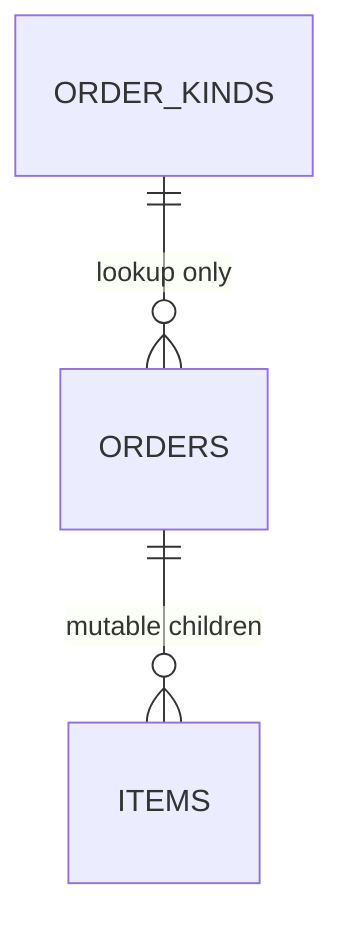

## Describe the writable graph

Consider three tables:

| Table | Role | Relationship |
| --- | --- | --- |
| `ORDERS` | Writable parent | Full parent identity and scalar business fields |
| `ITEMS` | Writable children | Many items belong to an order through ORDER_ID |
| `ORDER_KINDS` | Auxiliary lookup | Supplies kind data; never a DML target |



The high-level PATCH generation input describes the graph and its field policies.
This is the same outer-view structure used for a reader. The selected operation
controls generation; writer annotations add behavior to its graph. Reader and
writer DQL are authored independently and can select different fields, relations
and filters.
Declare the input and output contract names alongside their destination package.
The generator derives their fields, key projections and Current-state declarations
from the graph:

```sql
#package('example.com/shop/orders/write')
#setting($_ = $input_type('OrdersInput'))
#setting($_ = $output_type('OrdersOutput'))
#setting($_ = $case_format('lc'))
#define($_ = $Data<[]*Order>(output/body))
#setting($_ = $route('/orders', 'PATCH'))
#setting($_ = $connector('main'))
SELECT orders.*, items.*, kind.*,
       type(orders, 'Order'),
       type(items, 'Item'),
       type(kind, 'Kind'),
       lifecycle_type(orders, 'OrderLifecycle'),
       lifecycle_type(items, 'ItemLifecycle'),
       invariant(orders.WINDOW_START, 'DeliveryWindow'),
       invariant(orders.WINDOW_END, 'DeliveryWindow')
FROM (
    SELECT o.* FROM ORDERS o
) orders
LEFT JOIN (
    SELECT i.* FROM ITEMS i
) items ON items.ORDER_ID = orders.ID
LEFT JOIN (
    SELECT k.* FROM (ORDER_KINDS) k
) kind ON kind.ID = orders.KIND_ID AND 1=1
```

The database metadata supplies the real column types and keys. Use a start/end
date pair for WINDOW_START/WINDOW_END. The generator derives the request graph,
Previous reads and typed Go write support for the selected PATCH operation.
`input_type` and `output_type` name the component contracts (`OrdersInput` and
`OrdersOutput`) in the declared package. The outer `type(orders, 'Order')` and
`type(items, 'Item')` and `type(kind, 'Kind')` annotations name the individual shapes inside that
graph; they do not replace the input or output contract declarations.
`$Data<[]*Order>(output/body)` explicitly selects the typed main output holder;
`Data` is the Go output field and `body` is the writer output binding. The generated
writer populates it with the changed rows. Global `case_format('lc')` applies
Structology lower-camel casing to output names. Use this setting for routine
casing; do not add per-column JSON tags or a holder `WithTag` just to lowercase.
StructQL key projection is generated plumbing; the application should not need
to write a template loop to load Current rows.

The outer query defines the view graph: `orders`, `items` and `kind` are named
views, each supplied by its own subquery. The inner aliases `o`, `i` and `k` are
local to those SQL queries. Outer annotations address a view's projected column,
for example `orders.WINDOW_START`.

`FROM (ORDER_KINDS)` inside the `kind` view marks its source as auxiliary/nonmutating.
`AND 1=1` marks that joined relation as a single holder while keeping its real
key equality. The `items` view remains many. The generator must not infer that every joined
table is writable. Foreign-key constraints still belong to the database.


> Packaging boundary: Maintained writer graph, generated body/Current contract, child lifecycle and read-only auxiliary source authoring; excludes repository navigation and unrelated sections.
